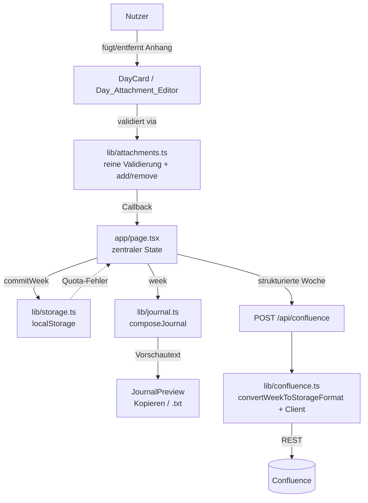
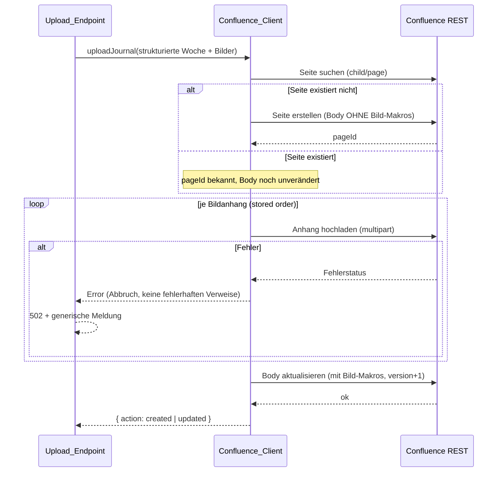

# Design Document

## Overview

Dieses Feature ergänzt den Wochenjournal-Generator um **Tagesanhänge**: pro
Wochentag (Mo–Fr) können optional **Bilder**, **Code-Snippets** und **Links**
erfasst werden. Die Anhänge fliessen in vier bestehende Pfade ein:

1. **Erfassung/Anzeige** in der Tageskarte (`Day_Attachment_Editor` in
   `components/DayCard.tsx`).
2. **Persistenz** zusammen mit der Woche im `localStorage` (`lib/storage.ts`).
3. **Vorschau & Textexport** über den `Journal_Composer` (`composeJournal` in
   `lib/journal.ts`).
4. **Confluence-Upload** über den `Storage_Converter` (`lib/confluence.ts`) und
   den `Upload_Endpoint` (`app/api/confluence/route.ts`).

Ein zweites, ausdrücklich gewünschtes Ziel ist die **Korrektur und Erhaltung von
Links (und neu Bildern/Code) im Confluence-Upload**. Die Sichtung der aktuellen
Implementierung bestätigt die Annahme aus den Requirements:

- `convertToStorageFormat(journalText: string)` maskiert **jede** Zeile vollständig
  (`escapeXml`: `&` → `&amp;`, `<` → `&lt;`, `>` → `&gt;`) und wandelt nur
  gepaarte `**…**` in `<strong>…</strong>` um. **URLs bleiben dadurch maskierter
  Klartext und sind in Confluence nicht klickbar.**
- Bilder und Code-Blöcke werden **gar nicht** unterstützt; der `Confluence_Client`
  (`uploadJournal`) lädt ausschliesslich einen Storage-Body hoch und kennt keine
  Seitenanhänge.

Das Design erweitert genau diese Stellen **chirurgisch** und **erhält das
bestehende Konvertierungsverhalten** (gepaarte Fett-Markierung, ein Absatz pro
Zeile, Klartext-Maskierung ohne Doppel-Maskierung, wohlgeformtes XHTML –
Requirement 9). Es werden **keine neuen npm-Dependencies** eingeführt
(`fast-check` und `vitest` sind bereits vorhanden), die Confluence-Zugangsdaten
bleiben **ausschliesslich serverseitig** in `process.env`.

### Wichtige Design-Entscheidungen

- **Validierungslogik nach `lib/`**: Alle Eingabe-/Grössen-/Anzahlregeln werden in
  ein neues, reines (JSX-freies) Modul `lib/attachments.ts` ausgelagert. Die
  Tageskarte ruft nur reine Funktionen auf. Das hält die Geschäftslogik aus der
  Komponente (Steering: „Keine Geschäftslogik in Komponenten") und macht die
  Regeln property-basiert testbar.
- **Bilder als Base64**: Bilddaten werden Base64-kodiert im `DayEntry`
  gespeichert, damit sie ohne Server/DB die Woche im `localStorage` überleben.
  **Konsequenz für das Speicherbudget**: Base64 vergrössert Bilder um ~33 %; bei
  bis zu 10 Wochen × 5 Tagen × 10 Anhängen kann das `localStorage`-Limit
  (~5 MB) erreicht werden. Das Schreiben wird deshalb fehlertolerant behandelt
  (Rollback + Hinweis, Requirement 5.3). Die 2-MB-Obergrenze je Bild
  (Requirement 4.3) begrenzt den Worst Case zusätzlich.
- **Confluence baut aus strukturierten Daten**: Da Code-Blöcke (mit
  Zeilenumbrüchen), klickbare Links und eingebettete Bilder **nicht** aus dem
  flachen Vorschautext rekonstruierbar sind, sendet der Client für den Upload die
  **strukturierte Woche** (Tagestexte + Anhänge je Tag + Reflexion). Das
  bestehende `convertToStorageFormat(text)` bleibt **verhaltensgleich** und wird
  als Primitive für jedes Textsegment wiederverwendet; ein neuer Aufbau fügt die
  Anhang-XHTML direkt nach dem jeweiligen Tag ein.
- **Bild-Upload vor Body-Veröffentlichung**: Bildanhänge werden erst auf die Seite
  hochgeladen, und **erst nach vollständigem Erfolg** wird der Seiten-Body mit den
  Bild-Makros geschrieben. So entsteht nie eine veröffentlichte Seite mit
  fehlerhaften Bildverweisen (Requirement 8.6).

## Architecture

### Datenfluss (Erfassung → Persistenz → Ausgabe)



State und Persistenz folgen den bestehenden Konventionen: Der zentrale State
liegt in `app/page.tsx`, Kinder erhalten Werte + Callbacks, ausschliesslich
`lib/storage.ts` spricht mit `localStorage`, ausschliesslich serverseitiger Code
(`route.ts` + `lib/confluence.ts`) spricht mit Confluence.

### Confluence-Upload-Sequenz (mit Bildern)



### Modulübersicht (was wird angefasst)

| Datei | Änderung |
|-------|----------|
| `types/journal.ts` | `Attachment`-Union (+ Untertypen) hinzufügen, `DayEntry.attachments` ergänzen, `ConfluenceUploadRequest` erweitern. Quelle der Wahrheit. |
| `lib/attachments.ts` | **Neu.** Reine Validierungs-/Konstruktorfunktionen, `addAttachment`/`removeAttachment`, Konstanten (Limits). |
| `components/DayCard.tsx` | `Day_Attachment_Editor`-Abschnitt: Hinzufügen/Entfernen/Vorschau, Validierungshinweise, Sperren bei `busy`. |
| `app/page.tsx` | Callbacks `addAttachment`/`removeAttachment`, Quota-Hinweis aus Storage-Ergebnis. |
| `lib/storage.ts` | Schreibergebnis (persistiert ja/nein) nach aussen geben für Rollback-Hinweis. |
| `lib/journal.ts` | `composeJournal`: Anhänge je Tag nach dem Tagesabsatz ausgeben. |
| `lib/confluence.ts` | `convertToStorageFormat` **unverändert im Verhalten**; neue reine Renderer (Link/Code/Bild) + `convertWeekToStorageFormat`; `uploadJournal` um Bild-Upload erweitern. |
| `app/api/confluence/route.ts` | Erweiterten Request validieren und an `uploadJournal` durchreichen. |
| `components/JournalPreview.tsx` | Upload-Request um strukturierte Woche erweitern. |

## Components and Interfaces

### `lib/attachments.ts` (neu, rein, JSX-frei)

```ts
import type { Attachment, CodeAttachment, DayEntry, ImageAttachment, LinkAttachment } from "@/types/journal";

// Grenzwerte (UPPER_SNAKE_CASE für echte Konstanten)
export const MAX_ATTACHMENTS_PER_DAY = 10;
export const MAX_URL_LENGTH = 2048;
export const MAX_DISPLAY_TEXT_LENGTH = 200;
export const MAX_CODE_LENGTH = 100_000;
export const MAX_LANGUAGE_LENGTH = 30;
export const MAX_CAPTION_LENGTH = 200;
export const MAX_IMAGE_BYTES = 2_000_000; // genau 2_000_000 noch zulässig
export const ALLOWED_IMAGE_MIME = ["image/png", "image/jpeg", "image/gif", "image/webp"] as const;

// Ergebnis-Typ: Erfolg liefert den Anhang, Fehler einen Hinweistext (UI-Sprache: Deutsch).
export type ValidationResult<T> =
  | { ok: true; value: T }
  | { ok: false; hint: string };

/** Validiert eine Link-Eingabe (URL/Anzeigetext) und erzeugt bei Erfolg einen LinkAttachment. */
export function validateLink(rawUrl: string, rawDisplayText: string): ValidationResult<LinkAttachment>;

/** Validiert eine Code-Eingabe (Quelltext/Sprache) und erzeugt bei Erfolg ein CodeAttachment. */
export function validateCode(source: string, rawLanguage: string): ValidationResult<CodeAttachment>;

/**
 * Validiert die Metadaten einer Bilddatei (Typ/Grösse/Bildunterschrift). Die
 * Base64-Konvertierung der Bytes geschieht in der Komponente (FileReader);
 * diese Funktion prüft nur die reinen, testbaren Regeln.
 */
export function validateImageMeta(meta: { mimeType: string; byteSize: number; caption: string }): ValidationResult<{ mimeType: ImageAttachment["mimeType"]; caption?: string }>;

/**
 * Hängt einen Anhang als letzten Anhang des Tages an, sofern das Limit nicht
 * erreicht ist. Bei erreichtem Limit bleibt der Tag unverändert und es wird ein
 * Hinweis zurückgegeben.
 */
export function addAttachment(day: DayEntry, attachment: Attachment): ValidationResult<DayEntry>;

/** Entfernt den Anhang mit der gegebenen id; übrige Anhänge bleiben in Reihenfolge. */
export function removeAttachment(day: DayEntry, attachmentId: string): DayEntry;
```

Validierungsregeln (verdichtet, gem. Requirements 1–4):

- **Link**: `url = rawUrl.trim()`. Leer → Hinweis „URL erforderlich". Beginnt
  nicht mit `http://`/`https://` → Hinweis „gültige URL". `url.length > 2048`
  oder `rawDisplayText.length > 200` → Längen-Hinweis. Sonst `LinkAttachment`
  mit `url` und (getrimmtem, nicht-leerem) `displayText` oder ohne.
- **Code**: `source.trim().length` muss `≥ 1` sein → sonst Hinweis „Quelltext
  erforderlich". `source.length > 100000` → Längen-Hinweis. `rawLanguage.trim().length > 30`
  → Längen-Hinweis. **`source` wird unverändert (ungetrimmt) gespeichert**
  (Requirement 3.5). `language` = getrimmt, falls nicht leer.
- **Bild**: `mimeType` muss in `ALLOWED_IMAGE_MIME` sein → sonst Format-Hinweis.
  `byteSize === 0` → „Datei ist leer". `byteSize > 2_000_000` → Grössen-Hinweis
  (genau `2_000_000` zulässig). `caption.length > 200` → Längen-Hinweis.
- **add**: `day.attachments.length >= 10` → Hinweis „maximal 10", Tag unverändert.
  Sonst `attachments: [...day.attachments, attachment]`.

### `components/DayCard.tsx` (`Day_Attachment_Editor`)

Erweiterung um einen Abschnitt unterhalb des Tagestexts. Neue Props (additiv,
bestehende Signatur bleibt erhalten):

```ts
interface DayCardProps {
  // … bestehende Props …
  /** Fügt einen erfassten/validierten Anhang dem Tag hinzu. */
  onAddAttachment: (attachment: Attachment) => void;
  /** Entfernt einen Anhang dieses Tages anhand der id. */
  onRemoveAttachment: (attachmentId: string) => void;
}
```

- Drei Bedienelemente (Link / Code / Bild) zum Hinzufügen (Requirement 1.1).
- Liste der vorhandenen Anhänge in `day.attachments`-Reihenfolge mit
  Entfernen-Button je Eintrag (Requirement 1.3, 1.4); Bilder mit Vorschau
  (`` aus Base64-Data-URL, Requirement 4.5).
- Eingabevalidierung über `lib/attachments.ts`; bei Fehler bleibt die Eingabe
  stehen und ein Hinweis wird angezeigt (Requirements 2–4); FileReader liest die
  ausgewählte Datei als Base64.
- Sämtliche Hinzufügen/Entfernen-Elemente sind `disabled`, solange `busy`
  (Generierung) **oder** ein Upload läuft (Requirement 1.5). Dazu erhält `DayCard`
  den vorhandenen `busy`-Wert; der Upload-Status wird in `page.tsx` in `busy`
  bzw. ein zusätzliches Flag einbezogen.

### `app/page.tsx`

- Neue Callbacks `addAttachment(weekday, attachment)` und
  `removeAttachment(weekday, attachmentId)`, die `lib/attachments.ts` nutzen und
  über `commitWeek` persistieren.
- `commitWeek` wertet das Storage-Ergebnis aus: Schlägt das Schreiben fehl
  (Quota), wird der State **nicht** auf den (unveränderten) gespeicherten Stand
  geändert und ein Hinweis via `setError` angezeigt (Requirement 5.3).
- Der Confluence-Upload (in `JournalPreview`) sendet zusätzlich die strukturierte
  Woche; der laufende Upload sperrt die Anhang-Bedienelemente.

### `lib/storage.ts`

`persist` meldet bereits intern Erfolg/Misserfolg. Damit die UI einen
Quota-Hinweis zeigen kann, wird eine Variante ergänzt, die das Ergebnis nach
aussen gibt – ohne die bestehende `saveWeek`-Signatur (und deren Tests) zu
brechen:

```ts
/** Wie saveWeek, gibt aber zusätzlich zurück, ob der Schreibvorgang gelang. */
export function saveWeekChecked(week: WeekJournal): { weeks: WeekJournal[]; persisted: boolean };
```

`saveWeek` bleibt als dünner Wrapper (`return saveWeekChecked(week).weeks`)
erhalten. Bei `persisted === false` bleibt – wie bisher – der zuvor gespeicherte
Stand unverändert (Rollback), und die Liste der unveränderten Wochen wird
zurückgegeben.

### `lib/journal.ts` – `composeJournal`

Der Tagesblock gibt nach dem Tagesabsatz die Anhänge dieses Tages in
gespeicherter Reihenfolge aus (Requirement 6). Pro Tag:

```
Montag: <Tagesabsatz oder –>
<Anhang 1>
<Anhang 2>
…
```

Ausgabeformat je Anhangtyp im Textexport:

- **Link**: `displayText (url)`, wenn `displayText` vorhanden **und** `≠ url`;
  sonst nur `url` (Requirements 6.2, 6.3, 2.5).
- **Code**: optionale Sprachzeile vorangestellt (z. B. `Code (ts):`), danach der
  Quelltext **unverändert** inkl. Zeilenumbrüchen/Einrückungen (Requirement 6.4,
  3.5).
- **Bild**: erkennbarer Platzhalter mit Bildunterschrift, sonst Dateiname, z. B.
  `[Bild: <caption|filename>]` (Requirement 6.5).

Hat ein Tag keine Anhänge, bleibt der Tagesabschnitt unverändert ohne
Platzhalter (Requirement 6.6).

### `lib/confluence.ts`

**Unverändert im Verhalten** bleiben `escapeXml`, `applyBold` und
`convertToStorageFormat(journalText: string)` (Requirement 9 wird direkt gegen
diese Funktion getestet).

Neu (rein, ohne Netzwerk):

```ts
/** Maskiert zusätzlich " für Attributwerte (href). */
function escapeAttr(value: string): string; // & < > "  (& zuerst)

/** Rendert einen Link als wohlgeformten Anker: href exakt, sichtbarer Text maskiert. */
export function renderLink(link: LinkAttachment): string;

/** Rendert ein Code-Snippet als Confluence-Code-Block-Makro mit maskiertem Body. */
export function renderCode(code: CodeAttachment): string;

/** Rendert ein Bild-Makro, das einen Seitenanhang über seinen Dateinamen referenziert. */
export function renderImageMacro(filename: string, caption?: string): string;

/** Baut den vollständigen Storage-Body aus der strukturierten Woche. */
export function convertWeekToStorageFormat(input: StorageWeek, imageFilenames: Map<string, string>): string;
```

Render-Regeln:

- **Link** (Requirement 7): `<a href="ESC_ATTR(url)">ESC_TEXT(displayText ?? url)</a>`,
  wobei `ESC_ATTR` `& < > "` maskiert und `ESC_TEXT` `& < >` maskiert. Die URL
  wird Zeichen für Zeichen (nur maskiert, nicht gekürzt/umgeschrieben) ins
  `href` übernommen.
- **Code** (Requirement 8.1–8.4): Confluence-`code`-Makro
  ```
  <ac:structured-macro ac:name="code">
    [<ac:parameter ac:name="language">ESC(lang)</ac:parameter>]
    <ac:plain-text-body>ESC(source)</ac:plain-text-body>
  </ac:structured-macro>
  ```
  Der Body wird mit `escapeXml` maskiert (kein CDATA → garantiert wohlgeformt und
  kein Zeichenverlust; `unescape(body) === source`). Sprachparameter nur, wenn
  vorhanden.
- **Bild** (Requirement 8.5): `<ac:image ac:alt="ESC_ATTR(caption)"><ri:attachment ri:filename="ESC_ATTR(filename)" /></ac:image>`.

`convertWeekToStorageFormat` reiht auf: Header → „Was habe ich…"-Überschrift →
je Tag (`Label: text` als Absatz via bestehender Textkonvertierung, danach die
Anhang-XHTML in gespeicherter Reihenfolge) → Reflexion. So bleiben die Anhänge
im **richtigen Tagesabschnitt** und in **gespeicherter Reihenfolge**.

`Confluence_Client` (`uploadJournal`) wird erweitert:

- Eingabe enthält strukturierte Tage + Bild-Anhänge (Base64 + MIME + Dateiname).
- Eindeutiger Anhang-Dateiname je Bild aus dessen `id` abgeleitet (vermeidet
  Kollisionen auf der Seite).
- Ablauf gem. Sequenzdiagramm: Seite sicherstellen (vorhandene finden oder mit
  bild-makrofreiem Body erstellen) → alle Bilder als Anhang hochladen → bei
  Erfolg Body inkl. Bild-Makros schreiben. Schlägt ein Bild-Upload fehl, bricht
  der Vorgang ab; es wird kein Body mit fehlerhaften Verweisen veröffentlicht
  (Requirement 8.6). Fehler werden weiterhin generisch und ohne Zugangsdaten
  gemeldet.
- Neuer Helper `uploadAttachment(config, pageId, filename, bytes, mimeType)`
  (multipart `file`-Feld, Header `X-Atlassian-Token: no-check`), Fehler über die
  bestehende generische Fehlerstrategie.

### `app/api/confluence/route.ts`

Validiert den erweiterten Request (strukturierte Tage + optionale Bilddaten),
reicht ihn an `uploadJournal` weiter und behält die bestehende
Status-/Fehlerlogik bei (`ConfigError` → 500, sonst → 502, generische Meldung).

## Data Models

### Attachment-Union (in `types/journal.ts`, Quelle der Wahrheit)

```ts
/** Gemeinsame Basis aller Tagesanhänge. */
interface AttachmentBase {
  /** Stabile id (crypto.randomUUID) für Reihenfolge, Entfernen und Confluence-Dateinamen. */
  id: string;
}

/** Bild-Anhang: Base64-kodierte Rasterdaten + Originaldateiname + optionale Unterschrift. */
export interface ImageAttachment extends AttachmentBase {
  type: "image";
  /** Base64-kodierte Bilddaten (ohne Data-URL-Präfix). */
  data: string;
  mimeType: "image/png" | "image/jpeg" | "image/gif" | "image/webp";
  /** Ursprünglicher Dateiname der ausgewählten Datei. */
  filename: string;
  /** Optionale Bildunterschrift (≤ 200 Zeichen). */
  caption?: string;
}

/** Code-Snippet: unveränderter Quelltext + optionale Sprachangabe. */
export interface CodeAttachment extends AttachmentBase {
  type: "code";
  /** Quelltext, unverändert (inkl. Zeilenumbrüchen/Einrückungen/umschliessender Leerzeichen). */
  source: string;
  /** Optionale Sprachangabe (≤ 30 Zeichen). */
  language?: string;
}

/** Link: URL + optionaler Anzeigetext. */
export interface LinkAttachment extends AttachmentBase {
  type: "link";
  /** Mit http:// oder https:// beginnende URL (≤ 2048 Zeichen). */
  url: string;
  /** Optionaler Anzeigetext (≤ 200 Zeichen); fehlt er, gilt die URL als Anzeigetext. */
  displayText?: string;
}

/** Diskriminierte Union aller Anhangtypen (über das Feld `type`). */
export type Attachment = ImageAttachment | CodeAttachment | LinkAttachment;
```

`DayEntry` wird additiv erweitert:

```ts
export interface DayEntry {
  weekday: Weekday;
  stichworte: string;
  text: string;
  /** Tagesanhänge in Reihenfolge ihres Hinzufügens (optional; fehlend = []). */
  attachments?: Attachment[];
}
```

`attachments` ist optional, damit bereits gespeicherte Wochen (ohne das Feld)
weiter geladen werden können; Lese-Code behandelt `undefined` als leere Liste.

### Confluence-Upload-Request (erweitert)

```ts
export interface ConfluenceUploadRequest {
  /** Fertig zusammengesetzter Journaltext (Vorschau/Fallback der Textsegmente). */
  journalText: string;
  kw: number;
  jahr: number;
  /** Strukturierte Tage mit Text und Anhängen für Link-/Code-/Bild-Wiedergabe. */
  days: DayEntry[];
  /** Reflexionsblock (Text). */
  reflexion: string;
}
```

Die Bilddaten reisen als Teil der `ImageAttachment` (Base64) im `days`-Array.
Der Server dekodiert sie für den Multipart-Upload (`Buffer.from(data, "base64")`).

### Persistenzformat (`localStorage`)

Unverändertes Schema (`wochenjournal_weeks`: Array von `WeekJournal`, max. 10),
ergänzt um `days[].attachments`. Da alles über `JSON.stringify`/`parse` läuft,
sind die Anhänge automatisch Teil der Serialisierung; es ist keine
Schema-Migration nötig (fehlendes Feld = keine Anhänge).

## Correctness Properties

*Eine Property ist eine Eigenschaft oder ein Verhalten, das über alle gültigen
Ausführungen eines Systems hinweg gelten soll – im Kern eine formale Aussage
darüber, was das System tun soll. Properties bilden die Brücke zwischen
menschenlesbarer Spezifikation und maschinell überprüfbaren
Korrektheitsgarantien.*

Das property-basierte Testen ist hier passend, weil die Kernlogik aus **reinen
Funktionen** besteht (Validierung, Komposition, XHTML-Konvertierung) mit grossen
Eingaberäumen (beliebige Strings, URLs, Quelltexte, Anhangfolgen) und klaren
universellen Eigenschaften (Round-Trips, Invarianten, Reihenfolge). Externe
Anteile (tatsächlicher Confluence-Bild-Upload, `localStorage`-Quota) sind
**nicht** PBT-geeignet und werden als Integration-/Beispieltests abgedeckt
(siehe Testing Strategy).

### Property 1: Hinzufügen erhält Einfügereihenfolge und begrenzt auf 10

*Für jeden* Tag und *jede* Folge hinzuzufügender Anhänge gilt: `addAttachment`
hängt einen akzeptierten Anhang als letztes Element an, bewahrt die Reihenfolge
der bestehenden Anhänge, und die Anzahl der Anhänge eines Tages überschreitet nie
10; ist bereits 10 erreicht, liefert `addAttachment` `ok:false` und lässt den Tag
unverändert.

**Validates: Requirements 1.4, 1.6, 1.7**

### Property 2: Entfernen entfernt genau das Ziel und bewahrt die Reihenfolge

*Für jeden* Tag und *jede* enthaltene Anhang-`id` gilt: `removeAttachment`
liefert genau die ursprüngliche Anhangliste ohne den Anhang mit dieser `id`, in
unveränderter relativer Reihenfolge der übrigen Anhänge.

**Validates: Requirements 1.3**

### Property 3: Link-Validierung

*Für jede* URL- und Anzeigetext-Eingabe gilt: `validateLink` akzeptiert genau
dann (`ok:true`), wenn die getrimmte URL mit `http://` oder `https://` beginnt,
ihre Länge ≤ 2048 ist und der Anzeigetext ≤ 200 Zeichen hat; in allen anderen
Fällen (leer/whitespace, falsches Präfix, Überlänge) liefert sie `ok:false` mit
einem Hinweis und erzeugt keinen Anhang.

**Validates: Requirements 2.1, 2.2, 2.3, 2.4**

### Property 4: Code-Validierung und unveränderte Quelltextspeicherung

*Für jeden* Quelltext und *jede* Sprachangabe gilt: `validateCode` akzeptiert
genau dann, wenn der getrimmte Quelltext ≥ 1 Zeichen hat, der (ungetrimmte)
Quelltext ≤ 100 000 Zeichen umfasst und die getrimmte Sprache ≤ 30 Zeichen hat;
bei Akzeptanz ist der gespeicherte `source` **zeichengleich** zur Eingabe (kein
Trim, keine Kürzung). Sonst `ok:false` mit Hinweis.

**Validates: Requirements 3.1, 3.2, 3.3, 3.4, 3.5**

### Property 5: Bild-Metadaten-Validierung

*Für jede* Kombination aus MIME-Typ, Bytegrösse und Bildunterschrift gilt:
`validateImageMeta` akzeptiert genau dann, wenn der MIME-Typ in der erlaubten
Menge (PNG/JPEG/GIF/WEBP) liegt, `1 ≤ byteSize ≤ 2 000 000` ist und die
Bildunterschrift ≤ 200 Zeichen hat (Grenze 2 000 000 inklusiv); sonst `ok:false`
mit passendem Hinweis.

**Validates: Requirements 4.1, 4.2, 4.3, 4.4, 4.6**

### Property 6: Persistenz-Round-Trip erhält Anhänge vollständig

*Für jede* Woche (inklusive Tage mit beliebigen Anhängen) gilt:
`JSON.parse(JSON.stringify(week))` liefert eine Woche, deren Tagesanhänge in
gespeicherter Reihenfolge, mit unverändertem Typ und vollständigem Inhalt (Link:
URL + Anzeigetext; Code: Quelltext + Sprache; Bild: Daten + Dateiname +
Bildunterschrift) erhalten bleiben.

**Validates: Requirements 5.1, 5.2**

### Property 7: Komposition gibt Anhänge nach dem Tagesabsatz in Reihenfolge aus

*Für jede* Woche gilt: In der `composeJournal`-Ausgabe erscheinen die
Repräsentationen der Anhänge eines Tages **nach** dem Tagesabsatz dieses Tages
und in **gespeicherter Reihenfolge**; besitzt ein Tag keine Anhänge, ist der
Tagesabschnitt identisch zur bisherigen (anhanglosen) Ausgabe ohne Platzhalter.

**Validates: Requirements 6.1, 6.6**

### Property 8: Export-Formatierung je Anhangtyp

*Für jeden* Anhang gilt in der `composeJournal`-Ausgabe: Ein Link erscheint als
`Anzeigetext (url)`, wenn ein vom URL abweichender Anzeigetext existiert, sonst
als alleinige `url`; ein Code-Snippet enthält seinen `source` **zeichengleich**
als Teilstring und – falls vorhanden – eine vorangestellte Sprachangabe; ein Bild
erscheint als erkennbarer Platzhalter, der die Bildunterschrift, sonst den
Dateinamen enthält.

**Validates: Requirements 6.2, 6.3, 6.4, 6.5, 2.5**

### Property 9: Link-Konvertierung erzeugt wohlgeformten Anker mit exaktem Ziel

*Für jeden* `LinkAttachment` gilt: `renderLink` erzeugt genau ein
`<a href="…">…</a>`-Element, dessen `href`-Wert nach XHTML-Entmaskierung
**zeichengleich** zur ursprünglichen URL ist (keine Kürzung/Umschreibung), dessen
sichtbarer Text nach Entmaskierung dem Anzeigetext (oder, falls keiner, der URL)
entspricht, und dessen Ausgabe keine rohen Sonderzeichen `& < >` (Text) bzw.
`& < > "` (Attribut) enthält.

**Validates: Requirements 7.1, 7.2, 7.3, 7.4, 7.5**

### Property 10: Code-Konvertierung ist verlustfrei (Round-Trip) mit korrektem Sprachparameter

*Für jeden* `CodeAttachment` gilt: `renderCode` erzeugt ein Confluence-`code`-Makro,
dessen Body nach XHTML-Entmaskierung **zeichengleich** zum `source` ist (kein
Zeichenverlust, keine Veränderung, inkl. Zeilenumbrüchen/Einrückungen), und das
genau dann einen `language`-Parameter enthält, wenn eine Sprachangabe vorhanden
ist.

**Validates: Requirements 8.1, 8.2, 8.3, 8.4**

### Property 11: Bild-Makros liegen im richtigen Tagesabschnitt in Reihenfolge

*Für jede* strukturierte Woche gilt: In der `convertWeekToStorageFormat`-Ausgabe
erscheint je Bildanhang genau ein `<ac:image>`-Makro, das den für diesen Anhang
vergebenen Dateinamen referenziert, innerhalb des Abschnitts des zugehörigen Tages
und in gespeicherter Reihenfolge der Anhänge dieses Tages.

**Validates: Requirements 8.5**

### Property 12: Gepaarte Fett-Markierung bleibt erhalten

*Für jede* Eingabezeile gilt: `convertToStorageFormat` wandelt nur **gepaarte**
`**…**` in `<strong>…</strong>` um; ein einzelnes, ungepaartes `**` bleibt als
Literal erhalten.

**Validates: Requirements 9.1**

### Property 13: Absatzstruktur pro Zeile

*Für jeden* Journaltext gilt: Jede nicht-leere Zeile wird zu genau einem
`<p>…</p>`, jede leere Zeile zu einem leeren Absatz (`<p />`); die Anzahl der
Absätze entspricht der Anzahl der Zeilen.

**Validates: Requirements 9.2**

### Property 14: Klartext-Maskierung ohne Doppel-Maskierung

*Für jede* Zeile ohne Fett-Markierung gilt: Die XHTML-Entmaskierung des
erzeugten Absatzinhalts ergibt **exakt** die ursprüngliche Zeile; insbesondere
entstehen keine doppelt maskierten Sequenzen (kein `&amp;amp;`).

**Validates: Requirements 9.3**

### Property 15: Wohlgeformtes XHTML für jeden Inhalt

*Für jede* Eingabe (beliebiger Journaltext und beliebige strukturierte Woche mit
Anhängen) gilt: Die Ausgabe von `convertToStorageFormat` bzw.
`convertWeekToStorageFormat` ist wohlgeformtes XHTML im Confluence-Storage_Format
(balancierte Tags, korrekt gequotete Attribute, ausschliesslich legale Entities).

**Validates: Requirements 9.4**

## Error Handling

- **Eingabevalidierung (UI)**: Ungültige Link-/Code-/Bild-Eingaben werden in
  `lib/attachments.ts` abgewiesen; die Tageskarte zeigt den zurückgegebenen
  deutschen Hinweis an und lässt die Eingabewerte unverändert stehen
  (Requirements 2–4). Das 10-Anhänge-Limit erzeugt ebenfalls einen Hinweis
  (Requirement 1.7).
- **Speicher-/Quota-Fehler**: `saveWeekChecked` fängt `localStorage`-Ausnahmen
  ab (`try/catch` um `setItem`). Bei Misserfolg bleibt der zuvor gespeicherte
  Stand unverändert (Rollback), der hinzugefügte/entfernte Anhang wird nicht
  übernommen, und `app/page.tsx` zeigt über `setError` einen Hinweis auf die
  erreichte Speicherbegrenzung (Requirement 5.3).
- **Confluence-Bild-Upload**: Schlägt das Hochladen eines Bildanhangs fehl, bricht
  `uploadJournal` ab, **bevor** ein Body mit Bild-Makros geschrieben wird. Damit
  existiert keine veröffentlichte Seite mit fehlerhaften Bildverweisen
  (Requirement 8.6).
- **Generische Fehlermeldungen / Geheimnisschutz**: Die bestehende Strategie in
  `confluenceFetch` bleibt unverändert: keine Zugangsdaten, URLs oder
  Antwortinhalte in Meldungen/Logs; der `Upload_Endpoint` antwortet generisch
  (`ConfigError` → 500, sonst → 502). Der neue `uploadAttachment`-Helper nutzt
  dieselbe Strategie.
- **Abwärtskompatibilität beim Laden**: Wochen ohne `attachments`-Feld werden als
  Tage ohne Anhänge behandelt (`day.attachments ?? []`); kein Migrationsschritt
  nötig.

## Testing Strategy

Es ist bereits ein Test-Setup vorhanden: **Vitest** (`vitest run`) mit
`**/*.test.ts` im node-Environment und dem `@/`-Alias, sowie **fast-check 4.8.0**
als Property-Testing-Library. Beide werden ohne neue Dependencies genutzt.

### Property-basierte Tests

- Eine eigene `it`-Property je Korrektheits-Property (Property 1–15).
- Mindestens **100 Iterationen** je Property (`{ numRuns: 100 }`), analog zum
  bestehenden `lib/journal.test.ts`.
- Tag-Kommentar je Test im bestehenden Format:
  `// Feature: day-attachments, Property {N}: {Kurztext}`.
- Generatoren:
  - Anhang-Arbitraries je Typ (Link/Code/Bild) inkl. Grenzwerte (Längen knapp
    ober-/unterhalb 2048/200/100000/30/2 000 000) und Edge-Fälle (Whitespace-only,
    0 Byte, nicht-erlaubte MIME-Typen) – deckt die als EDGE_CASE klassifizierten
    Kriterien 2.2, 3.2, 4.4 mit ab.
  - String-Generatoren mit Sonderzeichen `& < > "`, Zeilenumbrüchen und
    Nicht-ASCII für Escaping-/Round-Trip-Properties.
  - Wochen-Arbitrary (erweitert um `attachments`) für Komposition, Persistenz und
    `convertWeekToStorageFormat`.
- Hilfsfunktionen im Test: `unescapeXml`/`unescapeAttr` (Round-Trip-Prüfung) und
  ein **Well-Formedness-Check** (Property 15). Da keine XML-Parser-Dependency
  hinzugefügt werden darf, prüft der Check strukturell: balancierte/korrekt
  geschachtelte Tags, korrekt mit `"` gequotete Attributwerte und ausschliesslich
  legale Entities (`&amp;` `&lt;` `&gt;` `&quot;`). Die Anhang-XHTML wird zur
  Prüfung in ein Wurzelelement mit Namespace-Deklarationen (`ac:`, `ri:`)
  gekapselt.

### Beispiel-/Unit-Tests

- **Regressionsanker** (Beispiel): Konkrete Eingaben für `convertToStorageFormat`,
  die das heutige Verhalten festschreiben (gepaarte/ungepaarte `**`, Leerzeilen,
  `& < >`), um Requirement 9 zusätzlich punktuell abzusichern.
- **Quota-Fehler** (Beispiel, Requirement 5.3): Mock von `window.localStorage`,
  dessen `setItem` wirft → `saveWeekChecked` liefert `persisted:false` und die
  unveränderte Vorliste.

### Integrationstests (kein PBT)

- **Confluence-Bild-Upload / Abbruch** (Requirement 8.5 Upload, 8.6): `fetch` wird
  gemockt; 1–3 repräsentative Fälle:
  1. Erfolgreicher Ablauf: Seite sicherstellen → alle Bilder hochladen →
     Body-Update mit Bild-Makros (Reihenfolge/Tageszuordnung).
  2. Bild-Upload schlägt fehl → **kein** Body-Update mit Bild-Makros; der Endpoint
     antwortet mit Fehlerstatus und generischer Meldung ohne Zugangsdaten.
- Die reine Einbettungs-/Ordnungslogik selbst ist über Property 11 abgedeckt;
  der Integrationstest prüft nur die Aufrufreihenfolge gegen den externen Dienst.

### UI-Verifikation (manuell / nicht automatisiert im node-Setup)

Die rein darstellungsbezogenen Kriterien (1.1 Bedienelemente, 1.5 Sperren bei
Generierung/Upload, 4.5 Bildvorschau) werden manuell verifiziert, da das
Testsetup das node-Environment ohne DOM nutzt. Nach Code-Änderungen gilt zudem
die Projekt-Verifikation: `npm run lint`, `npx tsc --noEmit`, `npm run test` und
bei Bedarf `npm run build`.
