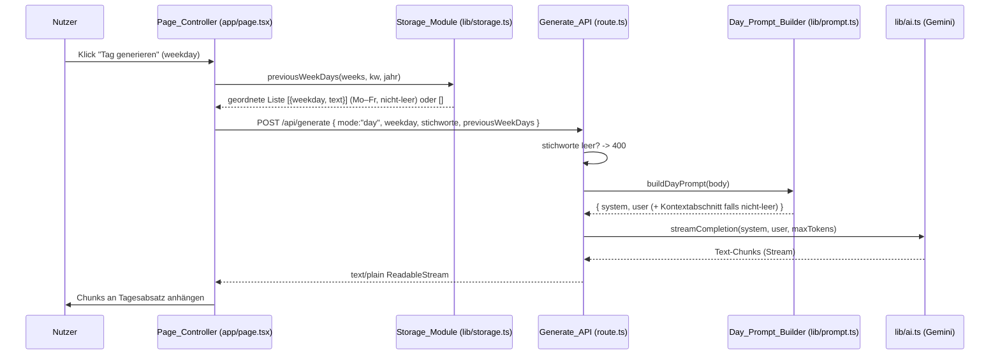

# Design Document

## Overview

Diese Funktion erweitert die Tagesgenerierung (Modus `"day"`), sodass die
Tagesabsätze der unmittelbar vorangegangenen gespeicherten Kalenderwoche als
klar abgegrenzter Kontextabschnitt in `buildDayPrompt` einfliessen. Der Kontext
dient ausschliesslich einem stimmigen inhaltlichen Übergang zwischen den Wochen
und der Vermeidung von Wiederholungen – niemals als neuer Inhalt. Der erzeugte
Absatz bleibt inhaltlich an den Stichworten des aktuellen Tages verankert, in
Schweizer Hochdeutsch und im bestehenden festen Format. Existiert keine Vorwoche
(erste Woche, Lücken im Verlauf), verhält sich die Generierung unverändert.

Das Konzept ist bewusst analog zur bereits bestehenden Reflexionsgenerierung
gestaltet, die Kontext aus bis zu drei Vorwochen einbezieht (`buildReflectionPrompt`).
Hier ist es auf **genau die eine** direkt vorangegangene Woche und auf die Ebene
der **Tagesabsätze** zugeschnitten.

### Designprinzipien

- **Chirurgische Änderung**: Es werden nur die fünf in den Requirements
  benannten Stellen angefasst (`types/journal.ts`, `lib/storage.ts`,
  `lib/prompt.ts`, `app/api/generate/route.ts`, `app/page.tsx`).
- **Quelle der Wahrheit**: Das Request-Format wird in `types/journal.ts`
  definiert; Client und Server nutzen denselben Typ.
- **Persistenz nur über `lib/storage.ts`**: Die Ermittlung der Vorwoche und ihrer
  Tagesabsätze ist eine reine Funktion über bereits geladenen Wochen.
- **Prompts nur in `lib/prompt.ts`**: Der Kontextabschnitt und die zugehörigen
  Systemanweisungen leben ausschliesslich dort.
- **Keine neuen Abhängigkeiten**, Next.js 16 / React 19-Konventionen,
  bestehendes Streaming (`text/plain` `ReadableStream`) bleibt unverändert.

## Architecture

### Datenfluss (Tagesgenerierung mit Vorwochen-Kontext)



### Verantwortlichkeiten je Modul

| Modul | Verantwortung in dieser Funktion |
|-------|----------------------------------|
| `lib/storage.ts` | Vorwoche chronologisch bestimmen und deren nicht-leere Tagesabsätze (Mo–Fr, geordnet) als Kontextliste liefern. |
| `types/journal.ts` | `GenerateRequest` (Modus `"day"`) um das verpflichtende, immer vorhandene Kontextfeld erweitern. |
| `lib/prompt.ts` | `buildDayPrompt` rendert bei nicht-leerem Kontext einen abgegrenzten Abschnitt; `SYSTEM_PROMPT_DAY` erhält Anweisungen zur reinen Übergangsnutzung. |
| `app/api/generate/route.ts` | Neues Feld entgegennehmen und an `buildDayPrompt` weiterreichen; bestehendes Streaming/Validierung/Fehlerverhalten unverändert. |
| `app/page.tsx` | Vor dem Senden den Kontext über `lib/storage.ts` ermitteln; bei Lookup-Fehler leere Liste; bestehender Streaming-Empfang unverändert. |

## Components and Interfaces

### Storage_Module (`lib/storage.ts`)

Neue, reine Funktion analog zur bestehenden `previousWeeks`, jedoch für die
**genau eine** Vorwoche und auf Ebene der Tagesabsätze. Sie kombiniert zwei
Schritte: die chronologisch unmittelbar vorangegangene Woche bestimmen und
deren nicht-leere Tagesabsätze in Mo–Fr-Reihenfolge extrahieren.

```ts
/**
 * Liefert die Tagesabsätze (Mo–Fr) der chronologisch unmittelbar vor (kw/jahr)
 * liegenden gespeicherten Woche mit nicht-leerem Text – als Kontext für die
 * Tagesgenerierung. Reihenfolge: Montag bis Freitag. Existiert keine solche
 * Vorwoche oder enthält sie keine nicht-leeren Tagesabsätze, wird eine leere
 * Liste zurückgegeben.
 */
export function previousWeekDays(
  weeks: WeekJournal[],
  kw: number,
  jahr: number,
): { weekday: Weekday; text: string }[];
```

Interne Logik:

- **Rang-Funktion**: identisch zur bestehenden `previousWeeks`-Logik
  (`rang = jahr * 100 + kw`). Das Jahr ist primäres, die KW sekundäres
  Sortierkriterium. Dadurch wird KW 53 eines Vorjahres korrekt als Vorwoche zu
  KW 1 des Folgejahres bestimmt (Jahresgrenze).
- **Auswahl**: Aus allen Wochen mit `rang(w) < grenze` (echt davor, nie identisch
  zur aktuellen Woche) wird die mit dem **grössten** Rang gewählt (kleinste
  chronologische Differenz). Gibt es keine solche Woche, ist das Ergebnis `[]`.
- **Tagesabsätze extrahieren**: Aus den `days` der gewählten Vorwoche werden
  alle Einträge mit `text.trim() !== ""` in der bestehenden `days`-Reihenfolge
  (entspricht `WEEKDAYS`, also Mo–Fr) auf `{ weekday, text }` abgebildet.
- **Wiederverwendung**: Die Funktion arbeitet auf einer bereits geladenen
  `WeekJournal[]`-Liste (wie `previousWeeks`/`findWeek`), damit der Aufrufer
  `loadWeeks()` steuert und die Funktion rein/testbar bleibt.

> Hinweis zur Reihenfolge der Auswahl: Die bestehende `previousWeeks` sortiert
> aufsteigend und nimmt `slice(-limit)`. Für die einzelne Vorwoche genügt es,
> das Maximum nach Rang unter den Kandidaten zu bestimmen (z. B. via Sortierung
> absteigend und `[0]`), was dieselbe „kleinste Differenz“-Semantik liefert.

### Types (`types/journal.ts`) – Quelle der Wahrheit

Der `"day"`-Zweig von `GenerateRequest` erhält ein **verpflichtendes** Feld
`previousWeekDays`. Es ist immer vorhanden; fehlt ein Kontext, ist es eine leere
Liste (nie `null`, nie weggelassen). Die Modi `"reflection"` und `"revise"`
bleiben unverändert.

```ts
export type GenerateRequest =
  | {
      mode: "day";
      weekday: Weekday;
      stichworte: string;
      /**
       * Tagesabsätze der direkt vorangegangenen Woche (Mo–Fr, nur nicht-leer),
       * als Kontext für einen stimmigen Übergang. Immer vorhanden; leere Liste,
       * wenn keine Vorwoche existiert oder diese keine Tagesabsätze enthält.
       */
      previousWeekDays: { weekday: Weekday; text: string }[];
    }
  | { mode: "reflection"; /* unverändert */ }
  | { mode: "revise"; /* unverändert */ };
```

### Day_Prompt_Builder (`lib/prompt.ts`)

`buildDayPrompt` liest zusätzlich `req.previousWeekDays`:

- **Nicht-leerer Kontext** (mindestens ein Eintrag): Der User-Prompt erhält einen
  durch Trennlinie und Überschrift abgegrenzten Kontextabschnitt – analog zum
  Stil von `buildReflectionPrompt` (`---` plus erklärende Überschrift). Format
  je Eintrag: `${weekdayLabel(weekday)}: ${text.trim()}`.
- **Leerer Kontext**: Der User-Prompt wird ohne Kontextabschnitt erzeugt; er
  enthält wie bisher Wochentag und Stichworte. Damit bleibt das Verhalten
  identisch zum heutigen Stand.
- **Reihenfolge im User-Prompt**: Wochentag und Stichworte des aktuellen Tages
  bleiben unverändert führend; der Kontextabschnitt folgt klar getrennt darunter.

`SYSTEM_PROMPT_DAY` wird um Anweisungen ergänzt (analog zur Formulierung in
`SYSTEM_PROMPT_REFLECTION`):

- Den Vorwochen-Kontext **ausschliesslich** für inhaltlichen Anschluss und
  Übergang nutzen.
- Keine Details aus der Vorwoche **erfinden oder wörtlich wiederholen**.
- Inhaltliche Grundlage des Absatzes bleiben **ausschliesslich** die Stichworte
  des aktuellen Tages.
- Alle bestehenden Vorgaben (genau ein Fliesstext-Absatz, kein Wochentags-Präfix,
  keine Aufzählung, Schweizer Hochdeutsch ohne „ß“) bleiben erhalten.

```ts
export function buildDayPrompt(
  req: Extract<GenerateRequest, { mode: "day" }>,
): { system: string; user: string } {
  let user = `Wochentag: ${weekdayLabel(req.weekday)}

Stichworte:
${req.stichworte.trim()}`;

  const kontextTage = req.previousWeekDays.filter((d) => d.text.trim() !== "");
  if (kontextTage.length > 0) {
    const kontext = kontextTage
      .map((d) => `${weekdayLabel(d.weekday)}: ${d.text.trim()}`)
      .join("\n\n");
    user += `

---
Kontext Vorwoche (nur für Anschluss/Übergang, nicht wiederholen oder erfinden):

${kontext}`;
  }

  return { system: SYSTEM_PROMPT_DAY, user };
}
```

### Generate_API (`app/api/generate/route.ts`)

- Der `"day"`-Zweig übergibt `body` weiterhin unverändert an `buildDayPrompt`;
  da das neue Feld Teil von `body` ist, sind keine zusätzlichen Zugriffe nötig.
- Die bestehende Leer-Validierung der Stichworte (`!body.stichworte?.trim()`
  → HTTP 400 mit Meldung zu fehlenden Stichworten) bleibt unverändert.
- Streaming (`text/plain; charset=utf-8` `ReadableStream`), Quota-Behandlung
  (429) und generischer Fehler (500) bleiben unverändert. Das neue Feld ändert
  das Ergebnisformat nicht.

### Page_Controller (`app/page.tsx`)

In `generateDay(weekday)` wird vor dem Senden der Kontext ermittelt:

```ts
let previous: { weekday: Weekday; text: string }[] = [];
try {
  previous = previousWeekDays(weeks, week.kw, week.jahr);
} catch {
  previous = []; // Fallback: Generierung trotzdem fortsetzen
}
// ...
body: JSON.stringify({
  mode: "day",
  weekday,
  stichworte: day.stichworte,
  previousWeekDays: previous,
}),
```

- Der bestehende `weeks`-State (aus `loadWeeks()`) wird wiederverwendet; es ist
  kein zusätzlicher Storage-Zugriff nötig.
- Der Empfangs-/Anhänge-Fluss über `readStream` (Chunks in Empfangsreihenfolge
  an den Tagesabsatz des adressierten Wochentags) bleibt unverändert.

## Data Models

### Kontext-Eintrag

Ein Eintrag des Vorwochen-Kontexts:

```ts
{ weekday: Weekday; text: string }
```

- `weekday`: genau einer der fünf Werte `montag | dienstag | mittwoch | donnerstag | freitag`.
- `text`: nicht-leerer Tagesabsatz-Text (nach Trim mindestens ein Zeichen).

### Kontext-Liste (`previousWeekDays`)

- Geordnete Liste in Mo–Fr-Reihenfolge.
- Höchstens fünf Einträge (je einer pro Wochentag Mo–Fr).
- Immer vorhanden; leere Liste, wenn keine Vorwoche existiert oder diese keine
  nicht-leeren Tagesabsätze enthält.

Die bestehenden Typen `Weekday`, `DayEntry`, `WeekJournal` bleiben unverändert;
es kommt lediglich das Request-Feld hinzu.

## Correctness Properties

*Eine Property ist ein Merkmal oder Verhalten, das über alle gültigen
Ausführungen eines Systems hinweg gelten soll – im Kern eine formale Aussage
darüber, was das System tun soll. Properties bilden die Brücke zwischen
menschenlesbarer Spezifikation und maschinell verifizierbaren
Korrektheitsgarantien.*

Die folgenden Properties decken die testbaren, universell quantifizierbaren
Kerne der Funktion ab: die chronologische Auswahl der Vorwoche und die Extraktion
ihrer Tagesabsätze (reine Logik in `lib/storage.ts`) sowie das Verhalten des
`buildDayPrompt` mit und ohne Kontext (reine Logik in `lib/prompt.ts`).
Statische System-Prompt-Inhalte sowie API-/Client-Verdrahtung werden über
Beispiel- und Integrationstests abgedeckt (siehe Testing Strategy), nicht über
Properties.

### Property 1: Vorwoche ist die chronologisch nächstgelegene frühere Woche

*Für jede* Liste gespeicherter Wochen und jede aktuelle Woche `(kw, jahr)` gilt:
Liefert die Auswahl eine Vorwoche, so hat diese unter allen Wochen mit
`rang(w) < rang(aktuell)` (mit `rang = jahr * 100 + kw`) den **grössten** Rang
(kleinste chronologische Differenz, korrekt über die Jahresgrenze KW 53 → KW 1),
und es ist nie die aktuelle Woche selbst; existiert keine solche frühere Woche,
ist das Ergebnis eine leere Liste.

**Validates: Requirements 1.1, 1.2, 1.3, 1.4**

### Property 2: Extrahierte Tagesabsätze sind die nicht-leeren Mo–Fr-Tage der Vorwoche

*Für jede* bestimmte Vorwoche gilt: Die zurückgegebene Kontextliste enthält genau
die Tagesabsätze mit `text.trim() !== ""` in der Reihenfolge Montag bis Freitag,
höchstens fünf Einträge, jeder Eintrag mit korrekt zugeordnetem `weekday` und
unverändertem Text; enthält die Vorwoche keinen nicht-leeren Tagesabsatz, ist das
Ergebnis eine leere Liste.

**Validates: Requirements 2.1, 2.2, 2.3, 2.4**

### Property 3: Nicht-leerer Kontext erzeugt einen abgegrenzten Kontextabschnitt

*Für jeden* `day`-Request mit mindestens einem nicht-leeren Eintrag in
`previousWeekDays` gilt: Der erzeugte User-Prompt enthält einen durch Trennlinie
und Überschrift abgegrenzten Kontextabschnitt mit den Texten aller nicht-leeren
Vorwochen-Tagesabsätze und enthält weiterhin den Wochentag-Label sowie die
getrimmten Stichworte des aktuellen Tages.

**Validates: Requirements 4.1, 4.3**

### Property 4: Leerer Kontext erzeugt keinen Kontextabschnitt

*Für jeden* `day`-Request, dessen `previousWeekDays` keinen nicht-leeren Eintrag
enthält (leere Liste oder ausschliesslich Whitespace-Texte), gilt: Der erzeugte
User-Prompt enthält keinen Kontext-Abschnitt (keine zugehörige Trennlinie /
Überschrift) und enthält weiterhin den Wochentag-Label sowie die getrimmten
Stichworte des aktuellen Tages.

**Validates: Requirements 4.2, 4.6**

## Error Handling

| Fall | Verhalten | Anforderung |
|------|-----------|-------------|
| Keine Vorwoche gespeichert | `previousWeekDays` liefert `[]`, kein Fehler | 1.4 |
| Vorwoche ohne nicht-leere Tagesabsätze | `previousWeekDays` liefert `[]` | 2.3 |
| Storage-Lookup wirft im Client | `try/catch` in `generateDay`, Fallback auf leere Liste, Generierung läuft weiter | 7.4 |
| Leere Stichworte im Request | Generate_API antwortet `400` mit Meldung zu fehlenden Stichworten (bestehend, unverändert) | 6.4 |
| Erschöpftes Gemini-Kontingent | Generate_API antwortet `429` mit klarer Meldung (bestehend) | 6.5 |
| Sonstiger Generierungsfehler | Generate_API antwortet `500` mit generischer Meldung; kein unvollständiger Absatz als Ergebnis (bestehend) | 6.5 |

- Der Vorwochen-Kontext ist rein additiv: Er kann die bestehende Validierung und
  das Fehlerverhalten nicht verändern. Ein fehlender oder leerer Kontext führt
  nie zu einem Fehler, sondern zum unveränderten Verhalten von heute.
- `previousWeekDays` ist eine reine Funktion über bereits geladenen Daten und
  löst selbst keine I/O aus; der defensive `try/catch` im Client deckt
  unerwartete Laufzeitfehler ab und hält die Generierung funktionsfähig.

## Testing Strategy

Das Projekt nutzt **Vitest** (`npm run test` → `vitest run`) mit **fast-check**
für Property-Based-Tests (bereits als devDependency vorhanden, siehe
`lib/storage.test.ts`). Es werden keine neuen Abhängigkeiten eingeführt. Tests
für reine Logik liegen neben den Modulen in `lib/` (`*.test.ts`).

### Property-Based-Tests (fast-check)

PBT ist hier passend, weil die Kernlogik aus **reinen Funktionen** besteht
(Wochenauswahl, Tagesabsatz-Extraktion, Prompt-Aufbau) mit grossem Eingaberaum.
Jeder Property-Test:

- läuft mit **mindestens 100 Iterationen** (`{ numRuns: 100 }`),
- referenziert die Design-Property im Tag-Kommentar im Format
  **Feature: day-generation-previous-week-context, Property {Nummer}: {Property-Text}**,
- implementiert **genau eine** Korrektheits-Property.

| Property | Ort | Generatoren |
|----------|-----|-------------|
| Property 1 (Vorwochenauswahl) | `lib/storage.test.ts` (oder neue `lib/storage.previous-week-days.test.ts`) | Listen aus `WeekJournal` mit zufälligen `kw`/`jahr` (inkl. Jahresgrenzen, Duplikate, leere Liste) und zufällige aktuelle `(kw, jahr)`. |
| Property 2 (Tagesabsatz-Extraktion) | `lib/storage.*.test.ts` | Vorwoche mit zufälligen `days` inkl. reiner Whitespace-/Leer-Texte; verifiziert Filter, Mo–Fr-Reihenfolge, max. 5, weekday-Zuordnung, Null-Fall. |
| Property 3 (Kontext im Prompt) | `lib/prompt.test.ts` (oder neue `lib/prompt.day-context.test.ts`) | `day`-Request mit nicht-leerem `previousWeekDays` (1–5 Einträge), zufällige Stichworte/Wochentag. |
| Property 4 (kein Kontext) | `lib/prompt.*.test.ts` | `day`-Request mit leerem oder nur-Whitespace `previousWeekDays`, zufällige Stichworte/Wochentag. |

### Beispiel-/Unit-Tests

Für statische und konkrete Verhaltensweisen (nicht universell quantifizierbar):

- **System-Prompt-Inhalt** (`SYSTEM_PROMPT_DAY`): Beispieltests, dass die neuen
  Anweisungen vorhanden sind – Kontext nur für Anschluss/Übergang (4.4, 5.4),
  nichts erfinden/wörtlich wiederholen (4.5) – und die bestehenden Formatregeln
  (genau ein Fliesstext-Absatz, kein Präfix/Aufzählung, Schweizer Hochdeutsch
  ohne „ß“, nur aktuelle Stichworte als Grundlage) weiterhin enthalten sind
  (5.1, 5.2, 5.3). Passt zum Stil der bestehenden `lib/prompt.preservation.test.ts`.
- **Page-Fallback** (7.4): Beispieltest, dass bei einem Fehler in
  `previousWeekDays` eine leere Liste gesendet und die Generierung fortgesetzt
  wird.

### Integrations-/bestehende Tests

- **Generate_API** (`app/api/generate/route.test.ts`): Bestehende Tests bleiben
  grün; ergänzend 1–2 Beispiele, dass ein `day`-Request mit leerem und mit
  nicht-leerem `previousWeekDays` denselben `text/plain`-Stream-Response liefert
  (6.1) und nicht-leere Stichworte mit/ohne Kontext nicht zu `400` führen (6.3),
  leere Stichworte weiterhin `400` (6.4).
- **Modus-Erhaltung** (3.3): Bestehende `prompt.preservation`-Tests und
  `npx tsc --noEmit` stellen sicher, dass `reflection`/`revise` unverändert
  bleiben und der erweiterte `GenerateRequest`-Typ konsistent ist.

### Verifikation

Nach der Implementierung: `npm run lint`, `npx tsc --noEmit`, `npm run test`
und bei Bedarf `npm run build`. Der Dev-Server wird nicht als blockierender
Befehl gestartet.
