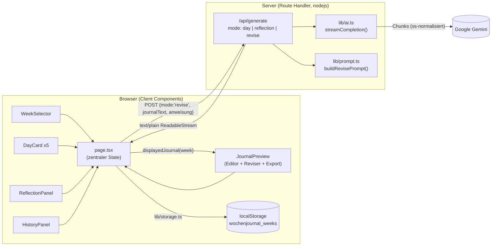
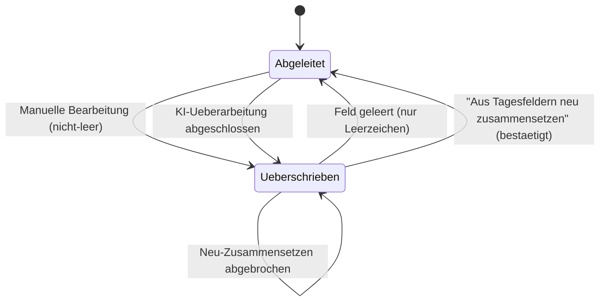

# Design – Journal Redesign & Bearbeitung

## Overview

Diese Erweiterung baut auf dem bestehenden **Wochenjournal-Generator** auf und
ergänzt drei Dinge, ohne die bestehende Architektur oder das feste Journalformat
zu verändern:

1. **Modernes Übersichts-Layout** – Tageseinträge (Mo–Fr), Reflexion und das
   fertige Gesamtjournal werden auf Desktop-Viewports (≥1024px) gleichzeitig
   sichtbar; unter 1024px in einer definierten einspaltigen Reihenfolge.
2. **Manuelles Bearbeiten des Gesamtjournals** – Ein Freitextfeld erlaubt das
   direkte Bearbeiten des zusammengesetzten Gesamttextes. Der bearbeitete Text
   wird als optionale **Überschreibung** (`journalText`) auf der Woche gespeichert
   und hat Vorrang vor dem aus den Feldern abgeleiteten Text.
3. **KI-Überarbeitung des gesamten Journals** – Eine einzeilige Anweisung wird
   zusammen mit dem aktuellen Gesamtjournal an einen neuen Modus `revise` des
   bestehenden Streaming-Endpoints geschickt; das überarbeitete Journal wird
   streamend in den Journalbereich aufgebaut und anschliessend als Überschreibung
   gespeichert.

Die Erweiterung hält sich strikt an die bestehenden Konventionen: zentraler State
in `app/page.tsx`, Komponenten in `components/`, Logik in `lib/`, geteilte Typen
in `types/journal.ts`, Prompts ausschliesslich in `lib/prompt.ts`, `localStorage`
ausschliesslich über `lib/storage.ts`, Gemini-Aufruf und API-Key ausschliesslich
serverseitig (`app/api/generate/route.ts`, `lib/ai.ts`). Es werden **keine neuen
Dependencies** eingeführt (`@google/genai` bleibt das einzige KI-SDK).

### Leitidee: abgeleiteter Text vs. Überschreibung

Das Gesamtjournal hat genau **eine angezeigte Quelle**:

- Solange **keine** Überschreibung vorhanden ist, wird der Text aus den
  strukturierten Feldern abgeleitet (`composeJournal(week)`).
- Sobald eine **Überschreibung** (`week.journalText`, nicht leer nach Trim)
  vorhanden ist, ist sie die alleinige Quelle für Vorschau, Bearbeitungsfeld,
  Kopieren und Download.

Diese Entscheidung wird an genau einer Stelle gekapselt – einer neuen Hilfsfunktion
`displayedJournal(week)` in `lib/journal.ts` – damit Vorschau, Editor und Export
garantiert denselben Text verwenden.

---

## Architecture

Die bestehende Datenflussrichtung bleibt unverändert; neu ist der Modus `revise`
und die Überschreibungs-Logik um das Gesamtjournal.



### Überschreibungs-Zustandsfluss



Im Zustand **Abgeleitet** ist `week.journalText` `undefined`/leer; im Zustand
**Überschrieben** enthält `week.journalText` den angezeigten Text. Der Wechsel
erfolgt ausschliesslich über die reinen Hilfsfunktionen in `lib/journal.ts`
(siehe unten), sodass die Logik testbar bleibt und nicht in der UI verstreut ist.

---

## Components and Interfaces

### `lib/journal.ts` (erweitert)

`composeJournal(week)` bleibt unverändert. Neu kommen reine, JSX-freie
Hilfsfunktionen hinzu, die die gesamte Überschreibungs-Logik kapseln:

```ts
/** True, wenn eine nicht-leere manuelle Überschreibung vorliegt. */
export function hasManualOverride(week: WeekJournal): boolean {
  return typeof week.journalText === "string" && week.journalText.trim() !== "";
}

/**
 * Der aktuell anzuzeigende Gesamtjournal-Text: die Überschreibung, falls
 * vorhanden, sonst der aus den Feldern abgeleitete Text. Einzige Quelle für
 * Vorschau, Editor, Kopieren und Download.
 */
export function displayedJournal(week: WeekJournal): string {
  return hasManualOverride(week) ? week.journalText! : composeJournal(week);
}

/**
 * Setzt eine manuelle Überschreibung aus dem Editor-Wert. Besteht der Wert nach
 * Trim nur aus Leerzeichen, wird die Überschreibung entfernt (zurück zum
 * abgeleiteten Text). Der Wert wird sonst unverändert (inkl. Whitespace) abgelegt.
 */
export function withJournalText(week: WeekJournal, value: string): WeekJournal {
  if (value.trim() === "") return withoutJournalText(week);
  return { ...week, journalText: value };
}

/** Entfernt die manuelle Überschreibung (Neu-Zusammensetzen aus den Feldern). */
export function withoutJournalText(week: WeekJournal): WeekJournal {
  if (week.journalText === undefined) return week;
  const { journalText: _drop, ...rest } = week;
  return rest;
}

/**
 * Prüft, ob die Woche ausser Header/Platzhaltern keinen Inhalt hat
 * (keine Überschreibung, kein Tagesabsatz, keine Reflexion). Für die
 * Leer-Prüfung von Export und KI-Überarbeitung.
 */
export function istInhaltsleer(week: WeekJournal): boolean {
  return (
    !hasManualOverride(week) &&
    !week.days.some((d) => d.text.trim() !== "") &&
    week.reflexion.trim() === ""
  );
}

/**
 * Dateiname für den Download: KW zweistellig mit führender Null,
 * Jahr vierstellig: arbeitsjournal-kw{KW}-{JAHR}.txt
 */
export function journalFileName(week: WeekJournal): string {
  const kw = String(week.kw).padStart(2, "0");
  const jahr = String(week.jahr).padStart(4, "0");
  return `arbeitsjournal-kw${kw}-${jahr}.txt`;
}
```

> Begründung: Die gesamte Überschreibungs-Logik liegt in `lib/`, ist rein und
> ohne Seiteneffekte. `page.tsx` und die Komponenten rufen nur diese Funktionen
> auf. Das hält die UI dünn und macht das Verhalten property-testbar
> (siehe Korrektheits-Eigenschaften).

### `lib/prompt.ts` (erweitert)

Neu: ein dritter System-Prompt und ein Builder in derselben Struktur wie die
bestehenden (`{ system, user }`). Die gemeinsamen `REGELN` werden wiederverwendet.

```ts
export const SYSTEM_PROMPT_REVISE = `Du bist ein Assistent für Lernende im dualen Bildungssystem der Schweiz.
Du überarbeitest ein bereits fertig zusammengesetztes Arbeitsjournal gemäss einer Anweisung des Nutzers.

Anforderungen an die Ausgabe:
- Behalte das feste Journalformat exakt bei: die Kopfzeilen (Arbeitsjournal – KW … / Lernender / Betrieb / Ausbildungsjahr), den Abschnitt "**Was habe ich diese Woche gemacht?**" mit den Tageszeilen Montag–Freitag sowie die vier Reflexions-Überschriften in genau dieser Reihenfolge:
  **Was ist mir in dieser Woche gut gelungen?**
  **Probleme / Herausforderungen**
  **Was kann ich besser machen in Zukunft?**
  **Was habe ich diese Woche neu gelernt?**
- Wende die Anweisung auf das gesamte Journal an und lass alle von der Anweisung nicht betroffenen Teile unverändert.
- Gib als Antwort AUSSCHLIESSLICH den überarbeiteten, vollständigen Journaltext zurück – ohne Einleitung, Kommentar oder Erklärung.

${REGELN}`;

/** Baut System- und User-Prompt für die Überarbeitung des Gesamtjournals. */
export function buildRevisePrompt(
  req: Extract<GenerateRequest, { mode: "revise" }>,
): { system: string; user: string } {
  const user = `Aktuelles Gesamtjournal:

${req.journalText.trim()}

---
Anweisung zur Überarbeitung:
${req.anweisung.trim()}`;

  return { system: SYSTEM_PROMPT_REVISE, user };
}
```

`REGELN` deckt bereits ab: Schweizer Hochdeutsch (kein „ß", immer „ss"), keine
erfundenen Details, nur den geforderten Inhalt ohne Kommentar. Damit erbt der
Revise-Prompt dieselben Stil- und Inhaltsregeln wie `SYSTEM_PROMPT_DAY` und
`SYSTEM_PROMPT_REFLECTION` (Requirement 4.4).

### `types/journal.ts` (erweitert)

```ts
export interface WeekJournal {
  id: string;
  kw: number;
  jahr: number;
  days: DayEntry[];
  reflexion: string;
  /**
   * Optionale manuelle Überschreibung des Gesamtjournals (0–50'000 Zeichen).
   * Fehlt das Feld oder ist es leer, wird der Text aus den Feldern abgeleitet.
   */
  journalText?: string;
  updatedAt: string;
}

export type GenerateRequest =
  | { mode: "day"; weekday: Weekday; stichworte: string }
  | {
      mode: "reflection";
      kw: number;
      jahr: number;
      days: { weekday: Weekday; text: string }[];
      previousWeeks: { kw: number; jahr: number; reflexion: string }[];
    }
  | { mode: "revise"; journalText: string; anweisung: string };
```

`GenerateRequest` bleibt die Quelle der Wahrheit und wird synchron zum Route
Handler gehalten (Requirement 5.2).

### `app/api/generate/route.ts` (erweitert)

Der bestehende Handler wird um den `revise`-Zweig ergänzt; Struktur und
Fehlerbehandlung (429/500, kein Key-Leak) bleiben unverändert.

```ts
const MAX_TOKENS_REVISE = 4096; // ganzes Journal kann länger sein

// ... innerhalb POST, nach dem reflection-Zweig:
} else if (body.mode === "revise") {
  if (!body.journalText?.trim()) {
    return new Response("Gesamtjournal fehlt.", { status: 400 });
  }
  if (!body.anweisung?.trim()) {
    return new Response("Anweisung fehlt.", { status: 400 });
  }
  ({ system, user } = buildRevisePrompt(body));
  maxTokens = MAX_TOKENS_REVISE;
} else {
  return new Response("Unbekannter Modus.", { status: 400 });
}
```

- `runtime = "nodejs"`, `dynamic = "force-dynamic"` bleiben (Requirement 5.5).
- Streaming über das bestehende `streamCompletion` → `text/plain; charset=utf-8`,
  kein SSE (Requirement 5.5). Die `ß`→`ss`-Normalisierung in `lib/ai.ts` greift
  auch hier (Requirement 3.6).
- API-Key nur aus `process.env.GEMINI_API_KEY` in `lib/ai.ts`; nie im Response
  oder Log (Requirements 5.4, 5.6).
- Ungültiges JSON / unbekannter Modus → 400 (5.7); Kontingent → 429 (5.8);
  sonstige Fehler → 500 (5.9). Bereits durch den bestehenden `try/catch` und den
  `else`-Zweig abgedeckt.

### `lib/storage.ts` (minimal erweitert)

`journalText` wird durch `JSON.stringify(weeks)` automatisch mitpersistiert und
beim Laden mitgelesen – `saveWeek` und `loadWeeks` brauchen keine strukturellen
Änderungen für das Speichern/Laden des Feldes. Bestandswochen ohne `journalText`
werden ohne Fehler geladen (`journalText` bleibt `undefined`) und damit wie „keine
Überschreibung" behandelt (Requirements 6.2, 6.4, 6.6).

Für das **Signalisieren von Schreibfehlern** (Requirement 6.3) wird `persist` so
angepasst, dass es Erfolg/Fehlschlag zurückgibt, und `saveWeek` gibt bei
Fehlschlag den **unveränderten zuvor gespeicherten Stand** zurück:

```ts
/** Schreibt zurück; true bei Erfolg, false bei Fehler (z. B. Quota/SSR). */
function persist(weeks: WeekJournal[]): boolean {
  if (!hasStorage()) return false;
  try {
    window.localStorage.setItem(STORAGE_KEY, JSON.stringify(weeks));
    return true;
  } catch {
    return false;
  }
}

export function saveWeek(week: WeekJournal): WeekJournal[] {
  const vorher = loadWeeks();
  const updated: WeekJournal = { ...week, updatedAt: new Date().toISOString() };
  const weeks = [updated, ...vorher.filter((w) => w.id !== updated.id)]
    .sort((a, b) => b.updatedAt.localeCompare(a.updatedAt))
    .slice(0, MAX_WEEKS);
  // Bei Schreibfehler bleibt der zuvor gespeicherte Zustand unverändert.
  return persist(weeks) ? weeks : vorher;
}
```

> Hinweis: `saveWeek` behält seine Signatur (`WeekJournal[]`). Bei einem
> Schreibfehler erhält der Aufrufer die **alte** Liste zurück; der angezeigte
> State bleibt damit konsistent mit dem persistierten Zustand. `deleteWeek` wird
> analog auf `persist`’ Rückgabewert umgestellt, ohne die Signatur zu ändern.

Das Entfernen der Überschreibung (`withoutJournalText`) erzeugt ein `WeekJournal`
ohne `journalText`-Feld; nach `saveWeek`/`loadWeeks` enthält die Woche kein
`journalText` mehr (Requirement 6.5).

### `app/page.tsx` (erweitert)

Der zentrale State wird minimal erweitert:

```ts
type Generating =
  | { type: "day"; weekday: Weekday }
  | { type: "reflection" }
  | { type: "revise" }
  | null;
```

`busy = generating !== null` blockt weiterhin **alle** Generierungen (Tag,
Reflexion, Überarbeitung) und damit parallele Requests (Requirements 8.2, 8.3).

Neue Handler (alle dünn, delegieren an `lib/journal.ts` und `commitWeek`):

```ts
function setJournalText(value: string) {
  commitWeek(withJournalText(week, value)); // setzt oder entfernt Überschreibung
}

function resetJournalToDerived() {
  commitWeek(withoutJournalText(week));     // nach Bestätigung in der Komponente
}

async function reviseJournal(anweisung: string) {
  if (busy || anweisung.trim() === "") return;          // 8.2/8.3
  if (istInhaltsleer(week)) {                            // 3.8
    setError("Erfasse zuerst Inhalte, bevor du das Journal überarbeitest.");
    return;
  }
  const original = displayedJournal(week);               // 3.3: aktuelles Journal
  setError(null);
  setGenerating({ type: "revise" });
  let working: WeekJournal = { ...week, journalText: "" };
  setWeek(working);
  try {
    const res = await fetch("/api/generate", {
      method: "POST",
      headers: { "Content-Type": "application/json" },
      body: JSON.stringify({ mode: "revise", journalText: original, anweisung }),
    });
    await readStream(res, (text) => {
      working = { ...working, journalText: text };        // streamend aufbauen
      setWeek(working);
    });
    setGenerating(null);
    commitWeek(working);                                  // 3.4: als Überschreibung speichern
  } catch (err) {
    setGenerating(null);                                  // 8.4/8.6: Zustand zurücksetzen
    setError(err instanceof Error && err.message ? err.message : FEHLERMELDUNG);
    // Teiltext bleibt in working/State erhalten (8.4)
  }
}
```

Der bestehende `readStream`-Helper wird unverändert wiederverwendet (gleiche
Fehler-/Banner-Logik wie Tag/Reflexion, Requirements 8.1, 8.5).

### `components/JournalPreview.tsx` (erweitert → Gesamtjournal-Bereich)

`JournalPreview` wird zur kontrollierten Komponente für den Gesamtjournal-Bereich
und vereint die logischen Funktionen **Journal_Editor** und **Journal_Reviser**.
Die bestehende Confluence-Upload-Funktion bleibt erhalten.

Props (neu, kontrolliert aus `page.tsx`):

```ts
interface JournalPreviewProps {
  week: WeekJournal;
  displayedText: string;     // displayedJournal(week)
  isOverride: boolean;       // hasManualOverride(week)
  istLeer: boolean;          // istInhaltsleer(week)
  revising: boolean;         // generating?.type === "revise"
  busy: boolean;
  onJournalTextChange: (value: string) => void; // -> setJournalText
  onReset: () => void;                          // -> resetJournalToDerived
  onRevise: (anweisung: string) => void;        // -> reviseJournal
  onError: (message: string) => void;           // Kopierfehler ins Banner (7.5)
}
```

Aufbau:

- **Manuell-bearbeitet-Kennzeichnung** (Requirement 2.7): sichtbares Badge
  („Manuell bearbeitet"), wenn `isOverride` true ist.
- **Editor** (Requirement 2): `<textarea maxLength={20000}>` mit `value =
  displayedText`, `onChange → onJournalTextChange`. Während `revising` wird statt
  der Textarea der Streamtext mit blinkendem Cursor angezeigt (read-only, gleiche
  Optik wie DayCard/ReflectionPanel). Das Vorbelegen mit dem abgeleiteten Text
  ergibt sich automatisch aus `displayedText` (2.2).
- **Aktion „Aus Tagesfeldern neu zusammensetzen"** (Requirement 2.5): nur sichtbar
  bei `isOverride`. Klick öffnet eine **Inline-Bestätigung** (zweistufig, zwei
  Buttons „Verwerfen" / „Abbrechen", lokaler State) → `onReset` bei Bestätigung
  (2.6, 2.8), unverändert bei Abbruch (2.9).
- **Reviser** (Requirement 3): einzeiliges `<input>` für die Anweisung +
  Button „Mit KI überarbeiten". Button deaktiviert, wenn Anweisung leer **oder**
  `busy` (3.2). Klick → `onRevise(anweisung)` (3.3).
- **Export** (Requirement 7): „Kopieren", „Download .txt", „Nach Confluence
  hochladen" verwenden `displayedText` statt `composeJournal(week)`.
  - Kopieren: bei Erfolg 2 s „✓ Kopiert!" (lokaler State, bestehendes Muster, 7.3);
    bei Fehler `onError(...)` → rotes Banner, Button-Text bleibt „Kopieren",
    Text bleibt erhalten (7.5).
  - Download: Dateiname über `journalFileName(week)` (7.2).
  - „Kopieren"/„Download" sind deaktiviert, wenn `istLeer` (7.4).
- **Vorschau**: das `<pre>` zeigt `displayedText` (read-only Darstellung neben dem
  Editor bzw. – mobil – darunter).

> Begründung gegen eine zusätzliche Datei: Editor, Reviser und Export operieren
> alle auf demselben Gesamtjournal-Text und teilen den Leer-/Override-Zustand.
> Sie in `JournalPreview` zu bündeln vermeidet Prop-Drilling und hält die
> Änderung chirurgisch (eine erweiterte Komponente statt mehrerer neuer).

### Layout in `app/page.tsx` (Requirement 1)

Das bestehende zweispaltige Grid wird zu einem Übersichts-Raster erweitert. Ziel:
ab 1024px alle fünf Tage als Raster + Reflexion + Gesamtjournal gemeinsam sichtbar;
darunter einspaltig in der Reihenfolge Wochenauswahl → Tageseinträge → Reflexion →
Gesamtjournal → Verlauf (1.4).

- **Tageseinträge** als eigenes Raster: `grid grid-cols-1 sm:grid-cols-2
  xl:grid-cols-3 gap-4` (oder `lg:grid-cols-5` für eine Tagesspalte je Tag), sodass
  ab 1024px alle fünf Tagesbereiche gleichzeitig ohne horizontales Scrollen
  sichtbar sind (1.1, 1.3). Leere Tage bleiben als Karte im Raster und werden als
  leer gekennzeichnet, nicht ausgeblendet (1.6).
- **Gesamtanordnung** (Desktop ≥1024px): linke schmale Spalte
  Wochenauswahl + Verlauf, rechte breite Spalte Tagesraster + Reflexion +
  Gesamtjournal – alles gemeinsam auf einer Seite (1.2, 1.9).
- **Mobil (<1024px)**: einspaltiger Fluss in der geforderten Reihenfolge (1.4).
- **Farbschema** unverändert über die bestehenden Theme-Tokens in `globals.css`
  (`--color-page` #F8F8F8, `--color-panel` #FFFFFF, `--color-sbb-red` #EB0000,
  `--color-sbb-red-hover` #C50000, `--color-ink` #222222, `--color-line` #E0E0E0)
  (1.7). UI-Texte bleiben Deutsch (1.8). Die Vorschau aktualisiert sich reaktiv
  über `displayedJournal(week)` bei jeder Feldänderung (1.5).

---

## Data Models

### `WeekJournal` (erweitert)

| Feld         | Typ                | Beschreibung                                                        |
|--------------|--------------------|---------------------------------------------------------------------|
| `id`         | `string`           | UUID der Woche (unverändert)                                        |
| `kw`         | `number`           | Kalenderwoche 1–53 (unverändert)                                   |
| `jahr`       | `number`           | ISO-Jahr (unverändert)                                              |
| `days`       | `DayEntry[]`       | Genau fünf Einträge Mo–Fr (unverändert)                            |
| `reflexion`  | `string`           | Reflexionsblock (unverändert)                                       |
| `journalText`| `string \| undef.` | **Neu, optional.** Manuelle Überschreibung des Gesamtjournals (0–50'000 Zeichen). Fehlt/leer ⇒ abgeleiteter Text. |
| `updatedAt`  | `string`           | ISO-Zeitstempel (unverändert)                                       |

### `GenerateRequest` – Variante `revise` (neu)

| Feld         | Typ       | Beschreibung                                  |
|--------------|-----------|-----------------------------------------------|
| `mode`       | `"revise"`| Diskriminator                                 |
| `journalText`| `string`  | Das vollständige aktuelle Gesamtjournal       |
| `anweisung`  | `string`  | Natürlichsprachliche Überarbeitungs-Anweisung |

### Persistenz

- Speicherort unverändert: `localStorage`-Key `wochenjournal_weeks`, Array von
  `WeekJournal`, max. 10 Wochen, Sortierung nach `updatedAt` absteigend.
- `journalText` wird transparent mit (de-)serialisiert. Bestandsdaten ohne das
  Feld bleiben gültig (rückwärtskompatibel).

---

## Correctness Properties

*Eine Eigenschaft ist ein Merkmal oder Verhalten, das über alle gültigen
Ausführungen des Systems hinweg gelten soll – im Grunde eine formale Aussage
darüber, was das System tun soll. Eigenschaften bilden die Brücke zwischen
menschenlesbaren Spezifikationen und maschinell überprüfbaren
Korrektheitsgarantien.*

Die folgenden Eigenschaften betreffen die **reine Logik** dieser Erweiterung
(Überschreibungs-Präzedenz, Lebenszyklus, Persistenz, Prompt-Aufbau, Validierung)
und sind über zufällige Eingaben property-getestet (mind. 100 Iterationen je
Eigenschaft). Layout, Streaming-Fluss, UI-Interaktionen und Tooling-Checks sind
nicht property-tauglich und werden über Beispiel-/Snapshot-/Integrationstests bzw.
`lint`/`tsc` abgedeckt (siehe Teststrategie).

### Property 1: Override-Präzedenz

*Für jede* `WeekJournal`-Woche gilt: Ist `journalText` nach Trim nicht leer,
liefert `displayedJournal(week)` exakt `week.journalText`; andernfalls liefert es
`composeJournal(week)`. Der angezeigte Text (und damit die Quelle für Vorschau,
Editor, Kopieren und Download) ist immer genau dieser Wert.

**Validates: Requirements 2.2, 2.4, 6.4, 7.1**

### Property 2: Überschreibungs-Lebenszyklus

*Für jede* Woche und *jeden* Eingabe-String `value` gilt: `withJournalText(week,
value)` setzt `journalText` genau dann auf `value`, wenn `value` nach Trim
nicht leer ist; ist `value` nach Trim leer, ist anschliessend keine
Überschreibung vorhanden. `withoutJournalText(week)` entfernt die Überschreibung
immer. Nach jeder Operation, die die Überschreibung entfernt, gilt
`displayedJournal == composeJournal`.

**Validates: Requirements 2.3, 2.8, 2.10**

### Property 3: journalText-Persistenz-Round-Trip

*Für jede* Woche mit nicht-leerem `journalText` gilt: `saveWeek` gefolgt von
`loadWeeks` und Suche derselben `id` liefert einen identischen `journalText`.
*Für jede* Woche ohne Überschreibung (z. B. nach `withoutJournalText`) gilt:
nach `saveWeek`/`loadWeeks` enthält die Woche kein `journalText`.

**Validates: Requirements 6.2, 6.5**

### Property 4: Rückwärtskompatibles Laden

*Für jede* Bestandswoche, die ohne das Feld `journalText` gespeichert wurde, gilt
nach dem Laden: `hasManualOverride(week)` ist `false` und `displayedJournal(week)`
gleich `composeJournal(week)`; das Laden wirft keinen Fehler.

**Validates: Requirements 6.6**

### Property 5: Schreibfehler-Invarianz

*Für jede* Woche gilt: Schlägt das Schreiben in `localStorage` fehl, bleibt der
zuvor gespeicherte Stand unverändert und `saveWeek` liefert die vorherige Liste
zurück (Fehlschlag signalisiert).

**Validates: Requirements 6.3**

### Property 6: Dateiname-Formatierung

*Für jede* Kalenderwoche `kw` (1–53) und *jedes* `jahr` liefert
`journalFileName(week)` einen Namen der Form `arbeitsjournal-kw{KW}-{JAHR}.txt`,
wobei `{KW}` zweistellig mit führender Null und `{JAHR}` vierstellig formatiert
ist.

**Validates: Requirements 7.2**

### Property 7: buildRevisePrompt enthält die getrimmten Eingaben

*Für jede* Kombination aus `journalText` und `anweisung` liefert
`buildRevisePrompt({ mode: "revise", journalText, anweisung })` ein Objekt mit
nicht-leerem `system` und `user`, wobei `user` sowohl den getrimmten
`journalText` als auch die getrimmte `anweisung` verbatim als Teilstring enthält.

**Validates: Requirements 4.2, 4.3**

### Property 8: Revise-Validierung leerer Felder

*Für jeden* `revise`-Request, bei dem `journalText` **oder** `anweisung` nach Trim
leer ist, antwortet der Generate-API-Handler mit HTTP 400, benennt das fehlende
Feld und ruft Gemini nicht auf.

**Validates: Requirements 5.3**

---

## Error Handling

| Fall                                       | Verhalten                                                                 | Req      |
|--------------------------------------------|---------------------------------------------------------------------------|----------|
| Anweisung leer / Generierung läuft         | Überarbeiten-Button deaktiviert, kein Request                             | 3.2, 8.2 |
| Journal inhaltsleer (nur Header/Platzhalter)| Hinweis im Banner, keine Überarbeitung                                    | 3.8      |
| Laufzustand nicht eindeutig „nicht laufend"| `busy`-Guard blockiert neuen Request                                      | 8.3      |
| Leerer `journalText`/`anweisung` (Server)  | HTTP 400 mit Benennung des fehlenden Felds, kein Gemini-Aufruf            | 5.3      |
| Ungültiges JSON / unbekannter Modus        | HTTP 400                                                                  | 5.7      |
| Kontingent erschöpft                       | HTTP 429; Client zeigt Server-Meldung im roten Banner                     | 5.8, 8.5 |
| Sonstiger Gemini-/Netzwerkfehler           | HTTP 500 ohne Details; rotes Banner „Generierung fehlgeschlagen …"        | 5.9, 8.1 |
| Fehler während des Streamens               | `generating=null`, bereits empfangener Teiltext bleibt im Feld erhalten   | 8.4      |
| Nach Fehler                                | Auslöser wieder aktiv (kein Reload nötig)                                 | 8.6      |
| Kopieren fehlgeschlagen                    | Fehlermeldung im Banner, Button-Text bleibt „Kopieren", Text erhalten     | 7.5      |
| Export bei leerem Journal                  | „Kopieren"/„Download" deaktiviert                                         | 7.4      |
| `localStorage` nicht verfügbar / Quota     | vorheriger Stand unverändert, Fehlschlag signalisiert, App bleibt nutzbar | 6.3      |

Der `revise`-Fluss nutzt denselben `readStream`-Helper und dasselbe rote Banner
wie Tag-/Reflexionsgenerierung; dadurch ist das Fehlerverhalten konsistent.

---

## Testing Strategy

Im Projekt ist **kein Test-Framework installiert**, und die Steering-Dokumente
sehen keines verbindlich vor. Die Verifikation erfolgt primär über:

- `npm run lint` → Exit-Code 0, null Errors/Warnings (Requirement 9.3).
- `npx tsc --noEmit` → Exit-Code 0, null Typfehler (Requirements 9.2, 9.4).
- ggf. `npm run build`.
- Manueller Durchlauf entlang der Akzeptanzkriterien (Layout-Breakpoints,
  manuelle Bearbeitung, KI-Überarbeitung inkl. Fehlerfälle, Export, Reload,
  Bestandsdaten).

### Property-Based Testing (empfohlen, optional einzurichten)

Die in den Korrektheits-Eigenschaften beschriebene **reine Logik** in
`lib/journal.ts`, `lib/prompt.ts` und `lib/storage.ts` ist ideal für
Property-Based Testing. Falls Tests eingerichtet werden, gilt:

- **Bibliothek:** `fast-check` (passt zu TS/Node; nicht selbst implementieren).
  Hinweis: Das ist eine **Dev-Dependency** und verletzt Requirement 9.1 nicht
  (dieses betrifft Laufzeit-/Fremd-SDK-Dependencies; das einzige KI-SDK bleibt
  `@google/genai`).
- **Iterationen:** mindestens 100 pro Eigenschaft.
- **Tag je Test:** Kommentar im Format
  `Feature: journal-redesign-edit, Property {Nummer}: {Property-Text}`.
- **Eine Eigenschaft = ein Property-Test.** `localStorage` wird für die
  Storage-Eigenschaften gemockt (In-Memory-Implementierung); für Property 8 wird
  der Route-Handler mit generierten Whitespace-Eingaben aufgerufen (kein echter
  Gemini-Aufruf, da die Validierung davor abweist).

| Eigenschaft | Ziel-Modul / Funktion                         |
|-------------|-----------------------------------------------|
| 1           | `lib/journal.ts` · `displayedJournal`         |
| 2           | `lib/journal.ts` · `withJournalText`/`withoutJournalText` |
| 3           | `lib/storage.ts` · `saveWeek`/`loadWeeks`     |
| 4           | `lib/storage.ts` · `loadWeeks` (Legacy)       |
| 5           | `lib/storage.ts` · `saveWeek` (persist-Fehler)|
| 6           | `lib/journal.ts` · `journalFileName`          |
| 7           | `lib/prompt.ts` · `buildRevisePrompt`         |
| 8           | `app/api/generate/route.ts` · revise-Validierung |

### Beispiel-, Snapshot- und Integrationstests

- **Beispiel/UI:** Editor-Vorbelegung, Override-Badge, zweistufige
  Neu-Zusammensetzen-Bestätigung (inkl. Abbruch), Button-Disabled-Zustände,
  Kopier-Bestätigung „✓ Kopiert!" und Kopierfehler, Auslöser nach Fehler wieder
  aktiv (Requirements 2.5–2.7, 2.9, 3.1–3.2, 7.3–7.5, 8.2–8.6).
- **Snapshot/visuell:** responsives Layout, gleichzeitige Sichtbarkeit aller fünf
  Tage ≥1024px, einspaltige Mobil-Reihenfolge, Farbschema, deutsche Texte
  (Requirement 1).
- **Integration (gemockter Stream/Fehler):** `revise`-Request → `text/plain`,
  Speicherung als Überschreibung, 429/500-Verhalten (Requirements 3.3–3.4,
  5.1, 5.5, 5.8–5.9, 8.1, 8.5).
- **Tooling/Architektur (Smoke):** keine neuen Laufzeit-Dependencies, Prompts nur
  in `lib/prompt.ts`, `localStorage` nur über `lib/storage.ts`, Key nur
  serverseitig (Requirements 9.1, 9.5–9.7).
