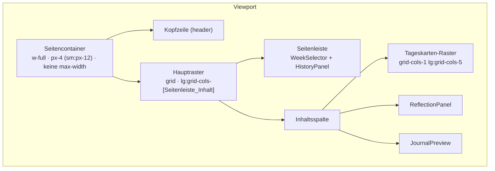

# Design Document

## Overview

Dieses Design beschreibt die moderne Neugestaltung der Oberfläche des
Wochenjournal-Generators. Die Änderung ist **rein gestalterisch und
strukturell auf Layout-Ebene**: Sie betrifft Darstellung, Anordnung und
Designtokens, nicht die Anwendungslogik, den State-Fluss, die Storage-Schicht
oder die API-Anbindung.

Die zentralen Ziele aus den Requirements:

1. **Volle Bildschirmbreite** – Entfernen der zentrierten Schmalspalte
   (`mx-auto max-w-6xl`) zugunsten eines Layouts, das die volle Viewport-Breite
   abzüglich eines tokenbasierten seitlichen Innenabstands nutzt
   (48px ab `sm`, 16px darunter).
2. **Funktionserhalt** – Wochenauswahl, fünf Tageskarten, Reflexion,
   Gesamtjournal mit vier Aktionen (Kopieren, Download, Confluence-Upload,
   KI-Überarbeitung), Verwerfen-Aktion und Verlauf bleiben unverändert
   funktionsfähig. Streaming, Sperren während Generierung und Fehlermeldungen
   bleiben erhalten.
3. **Modernes, markenneutrales Erscheinungsbild** – Konsequente Nutzung von
   Designtokens, klare Typografie-Hierarchie, keine SBB-Markengestaltung
   (keine SBB-Rot-Primär- oder -Akzentfarbe).
4. **Responsives Verhalten** – Einspaltig unter 1024px, zweispaltig
   (Seitenleiste + Inhalt) ab 1024px; Tageskarten ab 1024px nebeneinander
   (bis zu 5 Spalten).

### Designprinzipien

- **Chirurgische Änderungen**: Nur Klassen-Namen (Tailwind-Utilities) und die
  Token-Definitionen in `app/globals.css` werden angefasst. Props, Callbacks,
  Hook-Logik, Streaming-Lesen und Storage-Aufrufe bleiben bytegenau erhalten.
- **Tokenbasiert statt fest codiert**: Keine arbiträren Tailwind-Werte mehr für
  Farbe, Abstand und Eckenradius (`bg-[#...]`, `p-[13px]`, `rounded-[5px]`).
  Stattdessen ausschliesslich Theme-Utilities, die auf `@theme`-Tokens bzw. die
  Tailwind-Standardskala (selbst Tokens) zurückgehen.
- **Keine neuen Abhängigkeiten**: Tailwind v4 (`@theme`) reicht vollständig aus.

### Recherche / Stack-Kontext

- **Tailwind v4** (real installiert, siehe `tech.md`): Theme-Tokens werden im
  `@theme { ... }`-Block in `app/globals.css` als CSS-Variablen definiert und
  automatisch zu Utilities. Konventionen aus den gebündelten Docs und
  `nextjs-16-conventions.md`:
  - `--color-<name>` → `bg-<name>`, `text-<name>`, `border-<name>`,
    `ring-<name>`.
  - `--radius-<name>` → `rounded-<name>`.
  - `--container-<name>` → `max-w-<name>`.
  - Kein `tailwind.config.js` nötig.
- **Next.js 16 / React 19**: `app/page.tsx` bleibt Client Component mit
  zentralem State; alle `components/*` bleiben Client Components. An der
  `"use client"`-Direktive, der Server/Client-Aufteilung und am Route Handler
  ändert sich nichts.
- **Opazitäts-Modifier** (`text-ink/60`) gelten als tokenbasiert, da sie auf
  einen `@theme`-Farbtoken zurückgreifen und nur dessen Alpha anpassen; sie
  bleiben erlaubt.

## Architecture

### Layout-Struktur

Das Seitenlayout besteht aus einem äusseren **Seitencontainer** (volle Breite,
seitlicher Innenabstand, keine `max-width`), einer **Kopfzeile** und einem
**Hauptraster** mit zwei logischen Bereichen:

- **Seitenleiste** (links ab `lg`): Wochenauswahl + Verlauf.
- **Inhaltsspalte** (rechts ab `lg`): Tageskarten-Raster, Reflexion,
  Gesamtjournal.

Unter `lg` (1024px) kollabiert alles in eine einzige Spalte in logischer
Reihenfolge.



### Responsive Breakpoints

Es werden ausschliesslich Tailwind-Standard-Breakpoints verwendet (keine
benutzerdefinierten Breakpoints nötig):

| Breakpoint        | Viewport-Breite   | Verhalten                                                                                   |
|-------------------|-------------------|---------------------------------------------------------------------------------------------|
| Basis (`< sm`)    | `< 640px`         | Seitlicher Innenabstand 16px (`px-4`); alle Bereiche einspaltig; Tageskarten einspaltig.    |
| `sm`              | `≥ 640px`         | Seitlicher Innenabstand 48px (`sm:px-12`); weiterhin einspaltiges Hauptlayout.              |
| `lg`              | `≥ 1024px`        | Zweispaltig: Seitenleiste (Woche + Verlauf) getrennt von Inhaltsspalte; Tageskarten bis 5 Spalten (`lg:grid-cols-5`). |
| `xl`              | `≥ 1280px`        | Volle Breite minus 96px wirksam (96px = 2 × 48px), keine `max-width`-Begrenzung; max. 48px Rand je Seite. |

Da kein `max-width` gesetzt wird, ergibt sich die in Requirement 1.3 geforderte
Breite „Viewport minus 96px" bei `xl` automatisch aus `w-full` + `sm:px-12`
(48px je Seite). Es gibt keine separate `xl`-Regel; das Verhalten ist über alle
Breiten ≥ 640px identisch und erfüllt damit zugleich 1.1, 1.3 und 1.4.

Begründung für den `lg`-Wechsel (statt `xl`) bei der Spaltenaufteilung:
Requirement 4.3 verlangt die getrennte Seitenleiste „ab 1024px" und 4.5 die
nebeneinanderliegenden Tageskarten „ab 1024px" – beides exakt `lg`.

### Seitlicher Innenabstand und Überlauf

- `px-4` (16px) als Basis, `sm:px-12` (48px) ab 640px erfüllt 1.1 und 1.4.
- `w-full` ohne `max-width` erfüllt 1.2 und 1.3.
- Überlauf (1.5 / 4.4): Alle Container nutzen Fluss-Layout
  (`grid`/`flex`) mit umbrechenden Textfeldern (`w-full`, `resize-y`); keine
  festen Pixelbreiten an Kindern. Damit bleibt der Inhalt ohne horizontales
  Scrollen innerhalb des Viewports. Für den langen Journaltext sorgt
  Zeilenumbruch (`max-w-measure` = 75ch, siehe Datenmodelle) dafür, dass keine
  überlange Zeile den Container sprengt.

## Components and Interfaces

Wichtig: **Keine Schnittstelle ändert sich.** Alle Props, Callback-Signaturen
und der State in `app/page.tsx` bleiben exakt wie heute. Geändert werden nur
`className`-Werte (Präsentation) und – wo nötig – `rows`-Attribute für die
Mindesthöhe (3 Zeilen). Die folgende Tabelle zeigt das Mapping in das neue
Layout.

| Komponente / Bereich | Heute | Neu (Layout + Präsentation) | Funktion |
|----------------------|-------|------------------------------|----------|
| **Seitencontainer** (`app/page.tsx` Wurzel-`div`) | `mx-auto max-w-6xl px-4 py-6` | `w-full px-4 sm:px-12 py-6 sm:py-8` (keine `max-width`, kein `mx-auto`) | unverändert |
| **Kopfzeile** (`header`) | `text-2xl` Titel, Untertitel mit SBB-Bezug | `text-3xl sm:text-4xl font-bold text-ink` Titel; Untertitel markenneutral (`text-ink/60`) | unverändert |
| **Hauptraster** | `grid gap-6 lg:grid-cols-[2fr_3fr]` mit expliziter `col/row`-Platzierung | `grid gap-6 lg:grid-cols-[minmax(0,20rem)_minmax(0,1fr)] lg:items-start` | unverändert |
| **WeekSelector** | Karte in Spalte 1, Zeile 1 | In **Seitenleiste** (linke Spalte), oben | unverändert (`kw`, `jahr`, `onChange`) |
| **HistoryPanel** | Karte in Spalte 1, Zeile 2 | In **Seitenleiste**, unter WeekSelector | unverändert (`weeks`, `activeId`, `onSelect`, `onDelete`) |
| **Tageskarten-Raster** | `grid-cols-1 sm:grid-cols-2 xl:grid-cols-3` | `grid-cols-1 lg:grid-cols-5 gap-4` | 5 Karten Mo–Fr, unverändert |
| **DayCard** | Karte mit SBB-Rot-Button | Karte mit `primary`-Button, tokenbasiert; `textarea rows` ≥ 3 | unverändert (`day`, `label`, `streaming`, `busy`, Callbacks) |
| **ReflectionPanel** | Karte | Karte in Inhaltsspalte; Button `primary`; `textarea rows` ≥ 3 | unverändert |
| **JournalPreview** | Karte mit 4 Aktionen + Reviser + Verwerfen | Karte in Inhaltsspalte; `primary`-Buttons, `measure`-Breite (75ch) für Editor; `rows` ≥ 3 | unverändert (alle 4 Aktionen, Verwerfen, KI-Überarbeitung) |
| **Fehler-Toast** | `fixed bottom-4 right-4`, `border-sbb-red text-sbb-red` | gleiche Position, `border-danger text-danger`, tokenbasiert | unverändert (bleibt sichtbar bis Schliessen) |

### Seitenleiste vs. Inhaltsspalte (page.tsx)

Die heutige explizite Grid-Platzierung
(`lg:col-start-1 lg:row-start-1`, `lg:col-start-2 lg:row-span-2`,
`lg:col-start-1 lg:row-start-2`) wird durch eine klarere
Zwei-Container-Struktur ersetzt:

- **Seitenleiste** (`<div>` mit `flex flex-col gap-6`): enthält `WeekSelector`
  und `HistoryPanel`. Unter `lg` erscheint sie als erster Block; ab `lg` als
  linke Spalte. Mit `lg:sticky lg:top-8` kann die Seitenleiste optional beim
  Scrollen sichtbar bleiben (rein gestalterisch, tokenbasierter Abstand).
- **Inhaltsspalte** (`<div>` mit `flex flex-col gap-6`): enthält das
  Tageskarten-Raster, `ReflectionPanel` und `JournalPreview`.

Damit entfällt die fragile manuelle Zeilen-/Spaltenzuordnung; die natürliche
DOM-Reihenfolge (Seitenleiste → Inhalt) ergibt sowohl die korrekte einspaltige
Reihenfolge als auch eine der visuellen Anordnung folgende Tab-Reihenfolge
(Requirement 6.6).

### Design-Token-Strategie (`app/globals.css`)

Der `@theme`-Block wird markenneutral umgestellt. Die SBB-spezifischen Tokens
(`--color-sbb-red`, `--color-sbb-red-hover`) werden durch semantische,
markenneutrale Tokens ersetzt. Damit verschwindet die SBB-Markenfarbe
vollständig (Requirement 3.6) und alle Bereiche teilen dieselben Tokens
(3.1, 3.5).

Geplanter `@theme`-Block (Werte markenneutral, modern; finale Farbwerte können
beim Implementieren feinjustiert werden, solange Kontrast-Anforderungen aus
Requirement 6.4/6.5 erfüllt sind):

```css
@theme {
  /* Flächen / Neutraltöne */
  --color-page:          #f4f5f7; /* App-Hintergrund */
  --color-panel:         #ffffff; /* Karten-/Panel-Fläche */
  --color-panel-muted:   #f0f1f4; /* dezente Füllung (z. B. Stream-Vorschau) */
  --color-ink:           #1c2024; /* Primärtext */
  --color-line:          #dfe2e7; /* Rahmen/Trennlinien */

  /* Primär-/Akzentfarbe (markenneutral, NICHT SBB-Rot) */
  --color-primary:         #2f5fe0; /* primäre Aktionen */
  --color-primary-hover:   #2547b0; /* Hover */
  --color-on-primary:      #ffffff; /* Text auf primär */

  /* Semantische Statusfarbe für Fehler (generisch, keine Markenfarbe) */
  --color-danger:        #c8321f;
  --color-danger-hover:  #a5281a;

  /* Fokusindikator */
  --color-focus:         #2f5fe0;

  /* Eckenradien (semantisch) */
  --radius-control:      0.5rem;  /* Buttons, Eingaben → rounded-control */
  --radius-card:         0.75rem; /* Karten/Panels → rounded-card */

  /* Lesbreite für Fliesstext-Editor */
  --container-measure:   75ch;    /* → max-w-measure (Requirement 5.1) */

  --font-sans:
    system-ui, -apple-system, "Segoe UI", Roboto, Helvetica, Arial, sans-serif;
}
```

Konsequenzen für Utilities (automatisch generiert):

- `bg-primary`, `text-primary`, `border-primary`, `ring-primary`,
  `bg-primary-hover`, `text-on-primary`.
- `border-danger`, `text-danger`, `bg-danger`.
- `rounded-control`, `rounded-card`.
- `max-w-measure` (75ch).
- `ring-focus` für den Fokusindikator.

**Migrationsabbildung** (Such-/Ersetz-Strategie über `components/*` und
`page.tsx`):

| Alt | Neu |
|-----|-----|
| `bg-sbb-red` | `bg-primary` |
| `hover:bg-sbb-red-hover` | `hover:bg-primary-hover` |
| `text-sbb-red` (Aktionsbutton/Link) | `text-primary` |
| `border-sbb-red` (Aktionsbutton) | `border-primary` |
| `hover:bg-sbb-red/5`, `bg-sbb-red/5` | `hover:bg-primary/5`, `bg-primary/5` |
| `focus:border-sbb-red` | `focus:border-primary` + Fokusring (s. u.) |
| `border-sbb-red` / `text-sbb-red` (Fehler-Toast/Alert) | `border-danger` / `text-danger` |
| `rounded-lg` (Karten) | `rounded-card` |
| `rounded-md` (Controls) | `rounded-control` |

Die Status-Tokens `text-danger` für Fehler bleiben farblich von der
Primärfarbe getrennt, damit Fehlerzustände eindeutig bleiben und die
Primärfarbe nicht mit „Gefahr" verwechselt wird.

### Typografie-Hierarchie (Requirement 3.3)

Strikte, tokenbasierte Grössenstaffelung Kopfzeile > Bereichstitel > Fliesstext:

| Ebene | Utility | Verwendung |
|-------|---------|------------|
| Kopfzeile | `text-3xl sm:text-4xl font-bold` | App-Titel in `page.tsx` |
| Bereichstitel | `text-base font-semibold` (statt heute `text-sm`) | `h2`/`h3` in allen Panels/Karten |
| Fliesstext / Felder | `text-sm` | Eingaben, Tagesabsätze, Hinweise |

Damit gilt durchgängig 4xl/3xl > base > sm.

### Konsistente Abstände (Requirement 3.4)

Einheitliche, wiederkehrende Abstandstokens (Tailwind-Spacing-Skala) je
Übergangstyp:

- **Zwischen Bereichen** (Karte zu Karte, Seitenleiste-Blöcke): `gap-6`.
- **Bereichstitel zu Inhalt**: `mb-3` in allen Panels (heute teils `mb-2`,
  teils `mb-3` → vereinheitlichen auf `mb-3`).
- **Karten-Innenabstand**: `p-5` einheitlich in allen Karten (heute `p-4`).
- **Control-Innenabstand**: `px-3 py-2` für Eingaben, `px-3 py-1.5` für Buttons
  – bereits konsistent, wird beibehalten.
- **Tageskarten-Raster**: `gap-4`.

### Fokusindikator und Bedienelement-Konsistenz (Requirement 6.3, 3.5)

- Alle interaktiven Elemente (Buttons, Inputs, Textareas) erhalten einen
  sichtbaren, tokenbasierten Fokusring:
  `focus-visible:outline-none focus-visible:ring-2 focus-visible:ring-focus
  focus-visible:ring-offset-2`. Der Ring nutzt `--color-focus` und erfüllt
  damit das 3:1-Kontrastverlangen gegenüber angrenzenden Flächen.
- Gleichartige Controls verwenden identische tokenbasierte Klassencluster, die
  als gemeinsame Tailwind-Klassenkette pro Control-Typ definiert werden
  (Primär-Button, Sekundär-/Umriss-Button, Eingabe). So sind Farbe, Abstand und
  Radius über alle Bereiche identisch (3.5).

## Data Models

Es werden **keine** Datenmodelle geändert. `types/journal.ts`
(`Weekday`, `DayEntry`, `WeekJournal`, `GenerateRequest`,
`ConfluenceUploadResponse`) bleibt unverändert, ebenso `WEEKDAYS`. Die Logik in
`lib/journal.ts` (`displayedJournal`, `hasManualOverride`, `istInhaltsleer`,
`withJournalText`, `withoutJournalText`), `lib/storage.ts`, `lib/date.ts` und
die API-Routen werden nicht angefasst.

Die einzigen „Modelle", die dieses Design einführt, sind die oben definierten
**Designtokens** in `app/globals.css`. Diese sind reine Präsentationskonstanten
und haben keinen Einfluss auf Laufzeitdaten.

### Textfeld-Verhalten (Requirement 5)

| Feld | Heute | Neu |
|------|-------|-----|
| Stichworte (DayCard) | `rows={2}` | `rows={3}` (Mindesthöhe 3 Zeilen, 5.2) |
| Tagesabsatz (DayCard) | `rows={4}` | unverändert (≥ 3) |
| Reflexion | `rows={12}` | unverändert (≥ 3) |
| Gesamtjournal-Editor | `rows={18}` | unverändert (≥ 3); zusätzlich `max-w-measure` (75ch) + Zeilenumbruch (5.1) |

Alle Textfelder behalten `resize-y` (vertikal anpassbar, 5.2). Der
Gesamtjournal-Editor erhält `max-w-measure wrap` damit Zeilen bei 75 Zeichen
umbrechen und die Lesbarkeit bei voller Breite erhalten bleibt; das Feld bleibt
in einem ansonsten breiten Panel linksbündig.

## Correctness Properties

**Property-Based Testing ist für dieses Feature nicht anwendbar und wird
bewusst weggelassen.**

Begründung: Diese Spezifikation betrifft ausschliesslich UI-Rendering, Layout
und CSS-Designtokens. Es gibt keine reinen Funktionen mit Eingabe/Ausgabe und
keine über einen grossen Eingaberaum universell quantifizierbaren Eigenschaften
(„für alle Eingaben X gilt P(X)"). Die Anforderungen beschreiben visuelle und
strukturelle Merkmale (Breiten, Abstände, Spaltenanordnung, Farben,
Typografie, Fokusindikatoren), die nach den Projektregeln über
Layout-/Snapshot-Betrachtung und manuelle Prüfung verifiziert werden – nicht
über generierte Eingaben. Die zugrundeliegende Anwendungslogik
(`lib/*`, API-Routen) wird durch dieses Feature nicht verändert und ist bereits
durch bestehende Tests abgedeckt. Entsprechend folgt die Teststrategie unten
dem für UI-Redesigns angemessenen Ansatz.

## Error Handling

Die bestehende Fehlerbehandlung bleibt vollständig erhalten; nur die
Darstellung wird tokenbasiert markenneutral:

- **Generierung (Tag/Reflexion/Überarbeitung)**: Fehler werden weiterhin in
  `page.tsx` über `setError` gesetzt und als persistenter Toast unten rechts
  angezeigt (`role="alert"`), sichtbar bis der Nutzer ihn über die
  Schliessen-Schaltfläche (`aria-label="Meldung schliessen"`) entfernt
  (Requirement 2.9). Der Zielbereich bleibt inhaltlich unverändert – die
  bestehende `catch`-Logik (kein Überschreiben des Felds bei Fehler) wird nicht
  angetastet.
- **Confluence-Upload**: Die lokalen Statuszustände in `JournalPreview`
  (`loading`, `success`, `error`) bleiben; der Fehlerblock nutzt neu
  `border-danger`/`text-danger` statt SBB-Rot.
- **Kopieren**: Fehlschlag meldet weiterhin über `onError` eine
  deutschsprachige Meldung.
- **Farbcodierung**: Fehlerzustände nutzen `--color-danger` (semantisch), klar
  getrennt von der Primärfarbe, sodass Status eindeutig bleibt.

Alle Meldungstexte bleiben in Schweizer Hochdeutsch (ohne „ß"; Requirement 6.1)
und werden nicht verändert.

## Testing Strategy

Da dieses Feature ein reines UI-Redesign ist (Layout, Präsentation,
Designtokens) und keine Logik ändert, entfällt Property-Based Testing
(Begründung siehe oben). Es existiert zudem kein Komponenten-Test-Framework im
Projekt (siehe `tech.md`: „Kein Test-Framework vorgesehen; Verifikation manuell
+ lint/tsc/build"). Die Strategie ist daher mehrschichtig und an die
Projektrealität angepasst:

### 1. Statische Verifikation (automatisiert)

Nach jeder Änderung verpflichtend (siehe `guidelines.md`):

- `npm run lint` – keine ESLint-Fehler.
- `npx tsc --noEmit` – TypeScript strict ohne Fehler.
- `npm run build` – erfolgreicher Produktions-Build.

Da nur `className`-Strings und `rows`-Attribute geändert werden, müssen diese
Checks unverändert durchlaufen. Bestehende `lib/*`-Tests
(`npm test`, sofern vorhanden) müssen weiterhin grün bleiben, da keine Logik
berührt wird.

### 2. Token-/Markenneutralitäts-Prüfung (manuell + Suche)

- Grep nach Reststellen der alten Markentokens: kein Vorkommen von `sbb-red`
  (bzw. `sbb`) mehr in `components/*` und `app/page.tsx` (Requirement 3.6).
- Grep nach arbiträren Werten: keine `*-[#...]` (Hex), `*-[..px]`, `*-[..rem]`
  Tailwind-Klassen in geänderten Dateien (Requirement 3.2).

### 3. Manuelle Layout-Prüfung (visuell)

Verifikation der Layout-Anforderungen über Browser-DevTools bei definierten
Viewport-Breiten (`npm run dev` manuell durch den Nutzer gestartet):

| Prüfung | Breite | Erwartung (Requirement) |
|---------|--------|--------------------------|
| Voller-Breite-Layout, keine zentrierte Schmalspalte | 1920px | Inhalt = Viewport − 96px, ≤ 48px Rand je Seite (1.1–1.3) |
| Seitlicher Innenabstand klein | 375px | 16px Rand je Seite (1.4) |
| Kein horizontaler Scroll | 320px, 375px, 768px, 1024px, 1920px | keine horizontale Scrollleiste (1.5, 4.4) |
| Einspaltig | 375px, 768px | alle Bereiche untereinander; Tageskarten einspaltig (4.1, 4.2, 4.6) |
| Zweispaltig + Karten-Raster | 1024px, 1440px | Seitenleiste getrennt; Tageskarten nebeneinander ≤ 5 Spalten (4.3, 4.5) |
| Typografie | beliebig | Kopfzeile > Bereichstitel > Fliesstext (3.3) |
| Lesbreite Journal | 1920px | Editor bricht bei ~75 Zeichen um (5.1) |

### 4. Funktions- und Zugänglichkeits-Regressionsprüfung (manuell)

Sicherstellen, dass die Funktionalität unverändert ist (Requirement 2, 5, 6):

- Wochenauswahl (KW 1–53, aktuelle Woche vorausgewählt) – 2.1, 2.2.
- Tag generieren (Streaming, Sperren, Streaming-Hinweis, Freigabe danach) –
  2.3, 2.8, 5.3, 5.4, 5.5.
- Reflexion generieren – 2.4.
- Gesamtjournal: Kopieren, Download `.txt`, Confluence-Upload,
  KI-Überarbeitung, Verwerfen nach manueller Bearbeitung – 2.5, 2.6.
- Verlauf: Auswahl, Löschen, max. 10 Einträge – 2.7.
- Fehlermeldung bleibt bis Schliessen sichtbar, Zielbereich unverändert – 2.9.
- Tastaturnavigation in logischer Reihenfolge; sichtbarer Fokusring;
  `aria-label` an Icon-Buttons (Schliessen, Löschen) – 6.2, 6.3, 6.6.
- Kontrast: Primär-/Text-/Linien-/Fokus-Tokens gegen Hintergrund mit einem
  Kontrast-Werkzeug prüfen (Text ≥ 4,5:1, grosser Text/Grafik ≥ 3:1) – 6.4, 6.5.

> Hinweis: Vollständige WCAG-Konformität erfordert manuelle Prüfung mit
> assistiven Technologien und fachliche Begutachtung; die obigen Checks decken
> die in den Requirements genannten, prüfbaren Kriterien ab.
